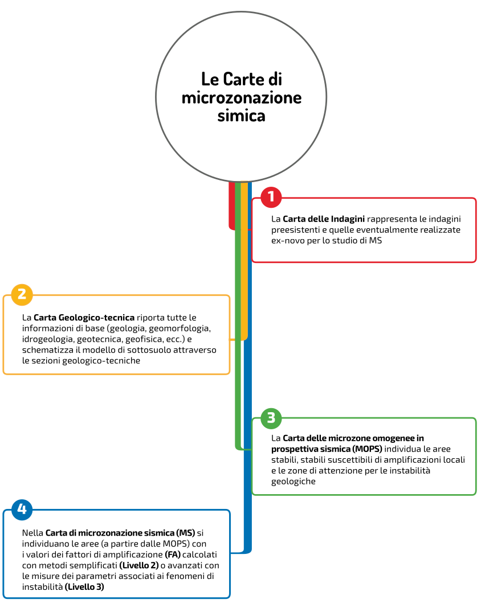

Introduzione
============

Gli studi di microzonazione sismica in Italia
---------------------------------------------

Dopo il terremoto in Abruzzo del 6 aprile 2009, è stato lanciato il "Piano nazionale per la prevenzione del rischio sismico" (legge 77/2009 art. 11) e sono state assegnate risorse sulla base dell'indice medio di rischio sismico dei territori per la realizzazione di studi di microzonazione sismica.

Per la realizzazione di tali studi, il documento tecnico di riferimento è rappresentato dagli **"Indirizzi e criteri per la microzonazione sismica"** (*"Gruppo di lavoro MS 2008. Indirizzi e criteri per la microzonazione sismica. Conferenza delle Regioni e delle Provincie autonome, 2008"*), di seguito **ICMS 2008**.

Per supportare i geologi e per facilitare e omogeneizzare l’elaborazione delle carte di microzonazione sismica (MS), sono stati predisposti degli **standard** (*Standard di rappresentazione ed archiviazione informatica, versione 4.2, 2020*), di seguito **Standard MS**. Questo documento, in particolare, costituisce il riferimento per la creazione di prodotti cartografici e per l'archiviazione delle informazioni utili per lo svolgimento degli studi.

Secondo gli "ICMS 2008" e gli "Standard MS", i principali prodotti cartografici da presentare negli studi di MS sono:

* la “Carta delle indagini”;
* la “Carta geologico-tecnica”;
* la “Carta delle microzone omogenee in prospettiva sismica”;
* la “Carta di microzonazione sismica”.

In generale, per ognuno di questi elaborati cartografici gli Standard indicano:

* le **tipologie di dati** necessari per la realizzazione delle carte (ad esempio indagini puntuali, indagini lineari, poligoni che rappresentano i terreni di copertura ed il substrato geologico, ecc.);
* i **simboli grafici** con cui rappresentare gli oggetti georeferenziati; è da evidenziare che gli standard riportano, per ogni simbolo, un esempio grafico con relativo codice e descrizione, ma non forniscono specifiche tecniche precise per la loro costruzione tramite un programma di grafica o GIS;
* i **layout delle carte**, riferibili ai diversi formati (A0, A1, A2), con specifiche riguardanti le dimensioni e la composizione di alcuni elementi quali ad esempio il cartiglio, la legenda ed il posizionamento delle informazioni relative all’autore o agli autori che hanno condotto gli studi; queste indicazioni servono alla costruzione dei layout per la produzione delle carte all’interno di specifici software GIS o di grafica, a discrezione dell’autore dello studio.

I prodotti cartografici devono essere accompagnati da una relazione illustrativa per ogni livello di approfondimento, oppure da una singola relazione nel caso in cui lo studio sia condotto su più livelli contemporaneamente. Tutti i prodotti dello studio, inoltre, devono essere inseriti all’interno di una **struttura di archiviazione ben definita**, costituita da  cartelle e file, rispettando una serie di indicazioni riguardanti il numero, formato, struttura e nome di ogni file. La conformità dello studio alle indicazioni degli Standard viene verificata in una fase di istruttoria che predede l'approvazione finale dello studio.

Nella prima parte degli standard (“Rappresentazione”) sono descritte le legende ed i layout delle carte, in modo conforme a quanto previsto dagli ICMS, nella seconda parte (“Archiviazione”) vengono descritte le specifiche tecniche per la predisposizione delle strutture di archiviazione dei dati alfanumerici e dei dati cartografici per la MS, con tavole sinottiche di aiuto alla costruzione delle Carte e dei dataset geografici ed alfanumerici. In particolare vengono qui descritte la struttura di archiviazione dei dati attraverso tabelle, la struttura dei dati georeferenziati vettoriali e le corrispondenze tra le simbologie da utilizzare nelle carte e le codifiche utilizzate nelle tabelle.

Attualmente gli Standard MS prevedono l'archiviazione delle informazioni all'interno di file in formato *shapefile*, per l’archiviazione delle informazioni georeferenziate, e di database in formato *Microsoft Access* (con estensione .mdb) per l’archiviazione delle informazioni tabellari sulle indagini.

Il plugin MzSTools
-------------------------

La realizzazione di uno studio di MS richiede l’utilizzo di strumenti software che permettano di svolgere diversi tipi di operazioni sui dati e che possano semplificare compiti ripetitivi e facilmente soggetti all’introduzione di errori:

* creazione, gestione ed editing di dati all’interno di strutture di database e geodatabase;
* gestione di progetti GIS contenenti i diversi layer cartografici, sia di base che tematici;
* inserimento e codifica di dati strutturati;
* utilizzo di strumenti di elaborazione e visualizzazione;
* allestimento dei layout per la produzione delle carte;
* importazione di dati pregressi ed esportazione verso altri formati;
* controllo degli errori topologici e di coerenza dei dati.

Gli ICMS 2008 e gli Standard MS definiscono le linee guida e le specifiche tecniche per l’esecuzione degli studi di MS. L’esecutore dello studio ha la facoltà di organizzare il proprio lavoro e di scegliere in autonomia gli strumenti da utilizzare:

* sistema di gestione di database per l’inserimento, la codifica e la gestione dei dati alfanumerici;
* software GIS per l’editing dei dati georeferenziati e la visualizzazione dei layer cartografici (ad esempio ESRI ArcGIS o QGIS);
* software per la gestione dei layout delle mappe e per la produzione cartografica, (software GIS oppure programmi di elaborazione grafica).

L'obiettivo che ha guidato lo sviluppo del plugin **MzSTools** è la *semplificazione delle procedure di realizzazione dei progetti e degli elaborati cartografici* che costituiscono uno studio di MS, secondo quanto stabilito dagli ICMS e dagli Standard, sfruttando le potenzialità dei software liberi quali `QGIS <https://qgis.org>`_ ed `SQLite/SpatiaLite <https://www.gaia-gis.it/fossil/libspatialite/index>`_.

Il plugin MzSTools riunisce in un unico ambiente una serie di strumenti utili alla conduzione degli studi di MS:

* **generazione automatica un progetto personalizzato**, pronto all’uso, per un qualsiasi comune oggetto di studio, contenente la struttura di file e cartelle necessaria, un database predisposto all’inserimento dei dati ed un progetto GIS preimpostato con layer cartografici, simbologie, layout di stampa ed una toolbar tramite la quale eseguire gli strumenti nelle varie fasi di lavoro;
* **geodatabase in formato SQLite/SpatiaLite** che permette di superare molte delle limitazioni insite nell’utilizzo del formato shapefile per i dati vettoriali georeferenziati, e del database Microsoft Access per la gestione delle indagini;
* **strumenti per l’editing** delle geometrie georeferenziate, coadiuvati da controlli topologici per assicurare la correttezza e coerenza dei layer cartografici;
* **interfacce di inserimento dati** user-friendly per le tabelle degli attributi dei layer vettoriali e per il database delle indagini, con sistemi per semplificare la codifica delle informazioni ed il rispetto dei vincoli imposti dagli standard con riferimento alle tipologie di dato, valori ammissibili per i diversi parametri, relazioni fra le tabelle, ecc.;
* **strumenti di importazione dei dati** presenti in un progetti già esistenti contenenti shapefile e database Access;
* **strumenti per l’esportazione del progetto** MzSTools in una struttura conforme agli Standard per il processo di validazione degli studi;
* **automatizzazione di alcune procedure di gestione dei dati**, come il calcolo degli spessori della colonna stratigrafica, l’applicazione di regole topologiche relative all'editing geometrico degli oggetti poligonali, ecc;
* **librerie di simboli pronti all’uso**, create in formato vettoriale .svg;
* **progetto GIS predisposto** con i principali layer cartografici necessari alla produzione delle carte di MS, completi di appositi filtri e regole di visualizzazione per l’inserimento nei layout di stampa;
* **layout cartografici preimpostati** che riducono i tempi di realizzazione delle mappe.

Il plugin MzSTools è pubblicato tramite il `repository ufficiale <https://plugins.qgis.org/plugins/MzSTools/>`_ dei plugin di QGIS ed è scaricabile direttamente tramite l’interfaccia di gestione delle estensioni di QGIS. Inoltre lo sviluppo del Plugin è aperto e i contributi, sotto forma di codice, suggerimenti e segnalazioni, possono essere proposti da chiunque tramite la piattaforma `GitHub <https://github.com/CNR-IGAG/mzs-tools>`_.

Videoguide
----------

Il plugin MzSTools è corredato da una serie di videoguide che illustrano le principali funzionalità del plugin.

Le videoguide sono disponibili sul `canale YouTube del plugin <https://youtube.com/playlist?list=PLM5qQOkOkzgWH2VogqeQIDybylmE4P1TQ&feature=shared>`_.

Riferimenti
-----------

* Gruppo di lavoro MS 2008. *Indirizzi e criteri per la microzonazione sismica*. Conferenza delle Regioni delle Provincie autonome. Roma: Presidenza del Consiglio dei Ministri - Dipartimento della protezione civile. Tratto il giorno 10/06/2021 da https://www.centromicrozonazionesismica.it/it/download/category/24-linee-guida

* Manuale utente di QGIS 3.16  tratto il giorno 10/06/2021 da https://docs.qgis.org/3.16/it/docs/user_manual/

* *Microzonazione Simica - Standard di rappresentazione ed archiviazione informatica* versione 4.2 Roma dicembre 2020: Commissione tecnica per la microzonazione sismica. Tratto il giorno 10/06/2021 da https://www.centromicrozonazionesismica.it/it/download/download/38-standardms-42/98-standardms-4-2

Changelog
---------

v2.0.4
    - Aggiornati alcuni layer e simbologie per i layout di stampa
    - Aggiornamento degli strumenti di sviluppo
    - Aggiornamenti per la compatibilità con PyQt6 (sperimentale)

v2.0.3
    - Sistemata la vista HVSR per i progetti creati con la versione 2.0.2, per i quali il template di database non
      includeva il cambiamento

v2.0.2
    - Risolti alcuni problemi di lentezza nel caricamento del progetto e di uso eccessivo di memoria causati
      dall'inserimento di un'immagine con risoluzione troppo elevata nei layout di stampa.
    - Aggiornata la vista dei valori HVSR in modo da includere i valori inseriti nella tabella non standard dedicata.
    - Corretto un simbolo SVG nella Carta Geologico-Tecnica e Carta delle MOPS

v2.0.1
    - Risoluzione di bug minori
    - Aggiornata la logica per la mappa HVSR tramite la creazione di una vista dedicata nel database

v2.0.0
    - Rinnovo generale del plugin
    - Miglioramento della gestione dei progetti e dei database
    - Accesso diretto e cross-platform ai database Microsoft Access ("CdI_Tabelle.mdb") per l'importazione ed
      esportazione dei dati (richiede l'installazione di Java JVM 64 bit e di librerie esterne gestite tramite il plugin
      per QGIS "QPIP")
    - Compatibilità preliminare con PyQt6

v1.9.4
    - Sistemati i layer per i layout di stampa

v1.9.3
    - Hotfix per la disconnessione dei segnali di editing
    - Sistemati i trigger delle tabelle stab, instab, isosub

v1.9.2
    - Introdotti alcuni elementi di compatibilità con le future versioni degli Standard MS
    - Unificati i layer "Zone stabili" e "Zone instabili" dei livelli 2-3, così come previsto dagli Standard MS
    - Nel progetto QGIS i layer gestiti dal plugin sono ora impostati come "richiesti", ed i layer per i layout di
      stampa sono impostati in sola lettura; l'utente viene avvisato nel caso in cui tenti di rinominare un layer
      richiesto
    - Semplificato e reso più efficiente lo strumento di creazione di un nuovo progetto
    - Aggiunto uno strumento per l'inserimento e la modifica dei metadati dello studio di MS
    - Sistemata e resa automatica l'impostazione dei controlli di editing topologico e sovrapposizione fra determinati
      layer, quali "Zone stabili" e "Zone instabili"
    - Aggiunto uno strumento di configurazione del plugin in cui è possibile attivare o disattivare l'impostazione
      automatica dei controlli di editing topologico e sovrapposizione fra i layer
    - Rimossi gli strumenti di editing dalla toolbar di MzS Tools (le impostazioni di editing topologico sono ora
      gestite automaticamente tramite gli strumenti di editing base di QGIS)
    - Rimosso lo strumento di copia delle feature fra i layer "Zone stabili" e "Zone instabili"
    - Risolti alcuni problemi con l'importazione e l'esportazione dei dati
    - Risolti diversi problemi minori

v1.9.1
    - Updated style expressions for MS level 2-3 layers

v1.9.0
    - Updated styles and print layouts
    - Improved compatibility with MS standard v4.2

v1.8.3
    - Updated styles and expressions in QGIS project
    - Updated and improved print layouts
    - Added available regional CTR WMS services
    - Fix potential problems in import process

v1.8.2
    - Experimental fixes for slow data import and export processes
    - Updated styles and expressions in QGIS project
    - Updated and improved print layouts

v1.8.1
    - Fix problem with version strings in project update

v1.8
    - QGIS project template improvements

v1.7
    - Update ISTAT administrative boundaries and codes to the `latest 2022 version <https://www.istat.it/it/archivio/222527>`_
    - Update styles for editing layers
    - Add QGIS action for punctual and linear surveys layers to directly search for available survey documents in the project folder

v1.6
    - Fix Python error in geotec editing
    - Update project template (snapping options, symbols)

v1.5
    - Ported to QGIS v3

v1.4
    -  Updated to new MS 4.2 standards;
    -  update project (fixed labels, update .py files, added new style);
    -  updated italian manual.

v1.3
    -  updated layout "CDI - Carta delle Indagini" (added legend);
    -  updated export shapefiles and "Export geodatabase to project folder" tool (to meet the standards);
    -  removed "Validate project" tool;
    -  fixed bug in log files;
    -  update project (fixed labels, update .py files);
    -  updated italian manual.

v1.2
    -  updated layouts ("Carta di Microzonazione Sismica (FA 0.1-0.5 s)", "Carta di Microzonazione Sismica (FA 0.4-0.8 s)", "Carta di Microzonazione Sismica (FA 0.7-1.1 s)");
    -  added "pkey" field in "Indagini" and "Parametri" tables;
    -  removed english manual.

v1.1
    -  modified the layout layer "CDI - Indagini puntuali";
    -  modified the layout layer "MOPS - HVSR";
    -  updated export database ("CdI_Tabelle.sqlite").

v1.0
    -  stable version;
    -  added a new video-guide ("Indagine stazione singola (HVSR)");
    -  update project (fixed labels and styles errors, update .py files);
    -  updated italian manuals.

v0.9
    -  update table "Indagine stazione singola (HVSR)", "freq.ui" mask and added a new layout ("Carta delle frequenze naturali dei terreni fr");
    -  update constraint "quota_slm_top_verify" and "quota_slm_bot_verify" in "indagini_puntuali", "parametri_puntuali" and "parametri_lineari" tables;
    -  moved export process to a separate thread;
    -  export progress shown in qgis interface;
    -  fixed bug in "siti_ind_param.py";
    -  update "New project" tool;
    -  added a new table ("metadati");
    -  added a new video-guide ("Indagine stazione singola (HVSR)");
    -  update project (in particular .ui, .py files);
    -  updated italian manuals.

v0.8
    -  fixed bug in "indagini_puntuali.py";
    -  update "siti_puntuali" and "siti_lineari" triggers;
    -  added a new table ("Indagine stazione singola (HVSR)") and a new layout ("Carta delle frequenze naturali dei terreni");
    -  update project (in particular .ui, .py files);
    -  changed update project process and removed "Update project" tool;
    -  updated italian manuals.

v0.7
    -  moved import process to a separate thread;
    -  import progress shown in qgis interface;
    -  fixed bug with empty numeric values in csv files during import;
    -  reimplemented import log file;
    -  added "Update project" tool;
    -  update project (in particular .ui, .py files);
    -  updated italian manuals.

v0.6
    -  video-guide additions;
    -  update project (in particular .ui, .py files);
    -  resolved bugs;
    -  updated italian manual.

v0.5
    -  improved "Add feature or record" tool;
    -  removed useless tool;
    -  update project (in particular .ui, .py files);
    -  resolved bugs;
    -  updated manuals.

v0.4
    -  initial relase.

Credits
-------

|logo_igag|

.. |logo_igag| image:: ../../mzs_tools/resources/img/logo_IGAG.png
    :width: 160px
    :target: https://www.igag.cnr.it

Il plugin viene sviluppato nell'ambito delle attività del
`Laboratorio GIS del CNR-IGAG <https://www.igag.cnr.it/lista-laboratori/labgis/>`_

**Contributors**

* Giuseppe Cosentino
* Francesco Pennica
* Emanuele Tarquini (v1.x)

**Special Thanks**

* Francesco Stigliano (MS projects support)
* Monia Coltella (MS standard support)
* Alessandro Pasotti (QGIS 3 port, v1.5)

**License**

This project is licensed under the **GPL-3.0 License**.

**Acknowledgements**

* External libraries:
    * `UCanAccess <https://github.com/spannm/ucanaccess>`_ (Apache-2.0 license)
    * `JayDeBeApi <https://github.com/baztian/jaydebeapi>`_ (LGPL-3.0 license)
* 'CNR' logo, 'IGAG' logo, 'LabGIS' logo, 'DPC' logo, 'Conferenza regioni e provincie autonome' logo and 'Regioni' logos belong to their respective owners who retain all rights in law;
* Italian administrative boundaries data by `Istituto Nazionale di Statistica (ISTAT) <https://www.istat.it/notizia/confini-delle-unita-amministrative-a-fini-statistici-al-1-gennaio-2018-2/>`_ - CC BY 4.0 Deed;
