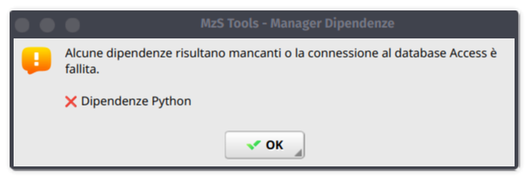
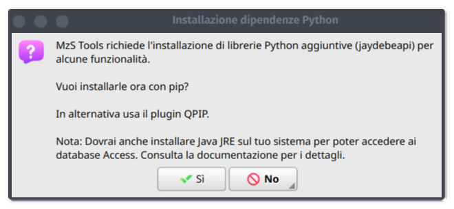
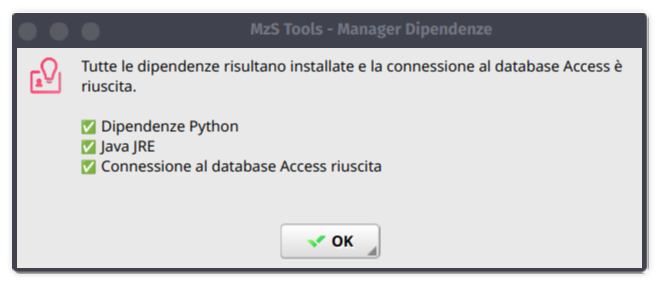
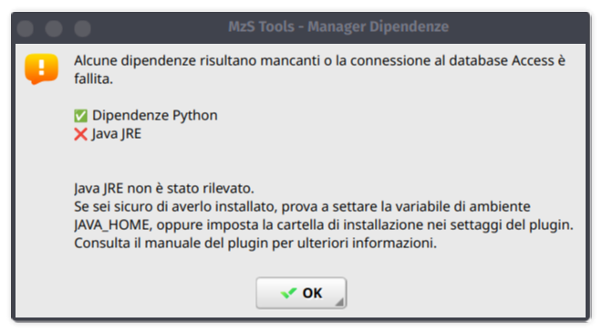
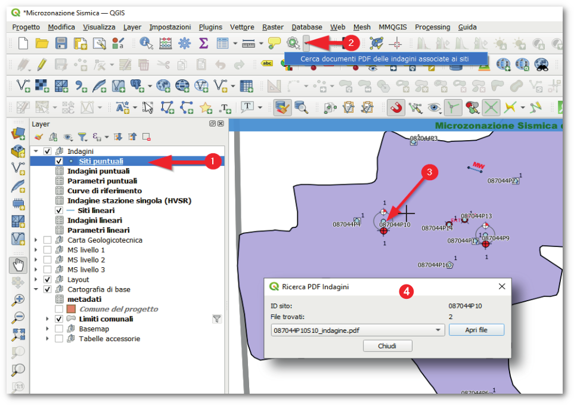

Altri strumenti
---------------

.. |ico1| image:: ../../../mzs_tools/resources/icons/ico_nuovo_progetto.png
  :height: 25

.. |ico2| image:: ../../../mzs_tools/resources/icons/ico_importa.png
  :height: 25

.. |ico3| image:: ../../../mzs_tools/resources/icons/ico_esporta.png
  :height: 25

.. |ico4| image:: ../../../mzs_tools/resources/icons/ico_edita.png
  :height: 25

.. |ico5| image:: ../../../mzs_tools/resources/icons/ico_salva_edita.png
  :height: 25

.. |ico6| image:: ../../../mzs_tools/resources/icons/ico_xypoint.png
  :height: 25

.. |ico7| image:: ../../../mzs_tools/resources/icons/mActionOptions.png
  :height: 25

.. |ico8| image:: ../../../mzs_tools/resources/icons/ico_info.png
  :height: 25

.. _metadata-edit:

Inserimento e modifica dei metadati
"""""""""""""""""""""""""""""""""""

Lo strumento della toolbar *Modifica metadati di progetto* |ico9| consente di inserire e modificare i metadati del progetto.

Al momento della creazione di un nuovo progetto, il plugin MzSTools richiede di inserire alcuni dati di base, tra i quali il nome ed indirizzo email
dell'autore dello studio. Questi dati, insieme ad altri dati ricavati dal progetto, vengono inseriti in una tabella del database in modo conforme a quanto
definito negli **Standard MS**.

Tramite lo strumento *Modifica metadati di progetto* è possibile modificare i dati inseriti in fase di creazione del progetto, e inserire  o modificare
ulteriori informazioni.

.. image:: ../img/edit_metadata.png
  :width: 600
  :align: center

.. _controllo-allegati:

Controllo dei file allegati
"""""""""""""""""""""""""""

Le interfacce di inserimento dati del plugin MzSTools consentono di allegare file esterni (in particolare documenti,
file di testo) ad alcuni elementi (indagini, parametri, ecc.), come richiesto dagli Standard MS.

Quando si allega un documento, nel database viene memorizzato solo il **percorso** del file allegato, che pertanto
potrebbe anche essere collocato al di fuori della cartella del progetto.

.. Note::
   Si consiglia di copiare o spostare sempre i file da allegare all'interno della cartella del progetto **prima di inserire
   i collegamenti tramite le interfacce di inserimento**, in modo da evitare problemi in caso di spostamento del progetto
   o di condivisione dello stesso con altri utenti.

Lo strumento della toolbar *Controllo file allegati* consente di verificare la presenza e la correttezza dei
file allegati alle indagini ed ai parametri, controllandone il percorso memorizzato nel database e spostandoli
nella cartella "Allegati" del progetto se necessario.

.. image:: ../img/controllo_allegati.png
  :width: 520
  :align: center

I file possono essere opzionalmente rinominati in modo automatico aggiungendo ai nomi gli ID degli elementi a cui sono
collegati, in modo da facilitare la loro identificazione e permettere l'utilizzo dello :ref:`consultazione-allegati`.

E\' particolarmente utile eseguire il controllo dei file allegati *prima* di eseguire l\':ref:`esportazione`.

.. _plugin-settings:

Impostazioni di MzS Tools
"""""""""""""""""""""""""

Lo strumento “Impostazioni di MzS Tools”, attivabile tramite il pulsante |ico7| della toolbar, consente modificare
alcune impostazioni del plugin.

Attualmente è possibile:

- attivare o disattivare l'impostazione automatica delle opzioni avanzate di editing per alcuni layer del progetto
  (vedi: :ref:`auto-overlaps`);
- abilitare i messaggi di log dettagliati, visualizzabili tramite il pannello "Messaggi di log" di QGIS (utile per
  il debug in caso di problemi);
- impostare manualmente il percorso di installazione della Java Runtime Environment (JRE o JDK), nel caso in cui
  questa non venga rilevata automaticamente (vedi: :ref:`installazione-java`).

.. image:: ../img/settings.png
  :width: 600
  :align: center

.. _plugin-deps:

Controllo delle dipendenze del plugin
"""""""""""""""""""""""""""""""""""""

Questo strumento consente di verificare che tutte le librerie Python e la Java Runtime Environment richiesti dal
plugin siano correttamente installati e funzionanti.

Al primo avvio dopo l'installazione di MzS Tools, lo strumento rileverà la mancanza delle librerie Python:

Dopo aver cliccato su Ok, lo strumento chiederà di procedere con l'installazione:

A questo punto, se anche Java viene rilevato correttamente, lo strumento effettuerà una connessione di test ad un
database Access e riporterà l'esito positivo dei controlli.

Nel caso in cui Java non venga rilevato, anche se correttamente installato, è possibile impostare manualmente il percorso
di installazione nelle :ref:`plugin-settings`, oppure impostare la variabile di ambiente ``JAVA_HOME``.

.. _consultazione-allegati:

Strumento di consultazione rapida indagini
""""""""""""""""""""""""""""""""""""""""""

Secondo gli Standard MS le informazioni relative alle indagini devono essere
organizzate in una struttura dati composta da:

- "siti" di indagine contenenti le geometrie georeferenziate lineari e puntuali;
- "indagini" vere e proprie, in rapporto n-1 con i siti;
- "parametri", ovvero i valori registrati per ogni tipologia di indagine, in
  rapporto n-1 con le indagini.

Questo rende difficoltoso l’accesso alle informazioni delle indagini a partire
dall’interrogazione dei siti collocati su mappa, in quanto ad ogni sito possono
essere correlate n indagini, ciascuna contenente un riferimento ad un file pdf
contenente le informazioni di dettaglio.

Per semplificare l’accesso a queste informazioni è stato realizzato un apposito
strumento basato sul meccanismo delle "azioni" associate ad un layer. Questa
funzionalità di QGIS permette di associare ad un layer vettoriale delle “azioni”
basate sugli attributi associati ai singoli elementi del vettore.

In questo caso è stata sviluppata un'azione che permette di accedere a tutti i
file pdf archiviati nel progetto ed associati ad ogni indagine, semplicemente
cliccando su un "sito" d'indagine e selezionando il file pdf da aprire tramite
una apposita interfaccia grafica.

.. Note:: Per il funzionamento dello strumento è necessario che i file allegati abbiano l'ID dell'indagine incluso nel nome del file.
   E\' possibile utilizzare lo strumento :ref:`controllo-allegati` per associare automaticamente gli ID delle indagini ai nomi dei file.

Per l'utilizzo dello strumento è possibile procedere in questo modo:

1. Selezionare il layer "Siti puntuali" o "Siti Lineari";
2. Selezionare l’icona "Azione" e fare clic su "Cerca documenti PDF delle
   indagini associate ai siti";
3. una volta attivato lo strumento è possibile cliccare su un sito d'indagine
   visualizzato sulla mappa per effettuare la ricerca dei documenti associati;
4. i risultati della ricerca vengono presentati in una apposita finestra
   contenente la lista dei file trovati.
