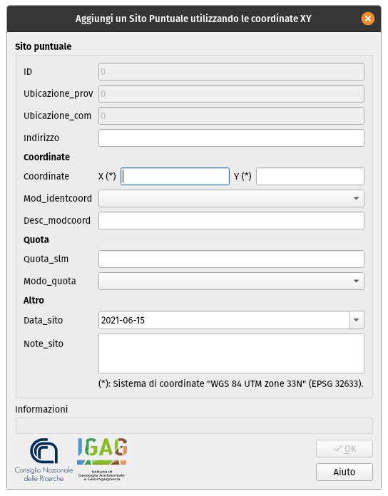
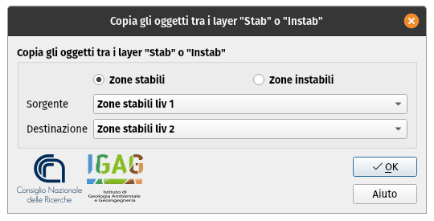
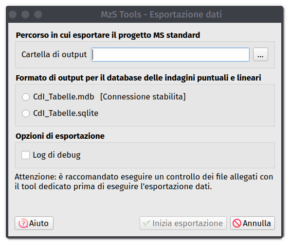

Altri strumenti
---------------

.. _sito-xy:

Inserimento Sito Puntuale tramite coordinate
""""""""""""""""""""""""""""""""""""""""""""

.. |ico1| image:: ../../../img/ico_nuovo_progetto.png
  :height: 25

.. |ico2| image:: ../../../img/ico_importa.png
  :height: 25

.. |ico3| image:: ../../../img/ico_esporta.png
  :height: 25

.. |ico5| image:: ../../../img/ico_salva_edita.png
  :height: 25

Lo strumento della toolbar *Aggiungi un Sito Puntuale utilizzando le coordinate XY* |ico6| consente di inserire un nuovo sito puntuale tramite l'indicazione delle coordinate X e Y (nel sistema **WGS84 UTM33N** - EPSG: 32633), senza dover digitalizzare il punto su mappa. 

.. _copia-oggetti:

Copia di oggetti fra i layer Stab e Instab
""""""""""""""""""""""""""""""""""""""""""

Lo strumento “Copy Stab or Instab layer”, attivabile tramite il pulsante |ico7| della toolbar, consente di copiare tutti i poligoni presenti in un layer *Zone stabili* (o *Zone instabili*) all’interno di un layer *Zone stabili* (o *Zone instabili*) di **livello diverso**. 

Questo consente di eseguire l’editing di un nuovo livello di approfondimento, utilizzando come base l’informazione spaziale dei poligoni provenienti da un precedente livello. 

Nella finestra viene richiesto di selezionare:

* i layer su cui lavorare (*“Zone stabili”* o *“Zone instabili”*);
* all’interno del campo *Sorgente*, il layer dal quale copiare le feature;
* all’interno del campo *Destinazione*, il layer nel quale verranno copiate le feature.

.. _esportazione:

Esportazione del progetto in una struttura standard
"""""""""""""""""""""""""""""""""""""""""""""""""""

La struttura di archiviazione generata dal plugin MzSTools non corrisponde esattamente a quella prevista dagli Standard, in quanto è ottimizzata per l’utilizzo con QGIS. 

La generazione di una struttura conforme agli Standard deve quindi essere considerata come fase finale del flusso di lavoro e può essere eseguita tramite l'apposito strumento di esportazione |ico3| presente sulla toolbar.

La finestra di dialogo dello strumento richiede semplicemente di selezionare una cartella  in cui effettuare l’esportazione. Le principali operazioni effettuate dallo strumento consistono in:

* esportazione dal geodatabase SQLite/Spatialite dei dati georeferenziati e tabellari verso file in formato *shapefile* ed un database “CdI_tabelle.sqlite”, conformi agli Standard;
* copia dei file e documenti allegati presenti nella cartella “allegati”.   

Al termine delle operazioni, il tool genera un **report testuale**, contenente l’esito dell’esportazione del progetto, all’interno della cartella di progetto ``/allegati/log``. Il nome del report sarà caratterizzato dalla data e dall’ora di esecuzione del tool, e dalla la dicitura “export_log” (ad esempio ``2018-06-13_09-06-23_export_log.txt``).
