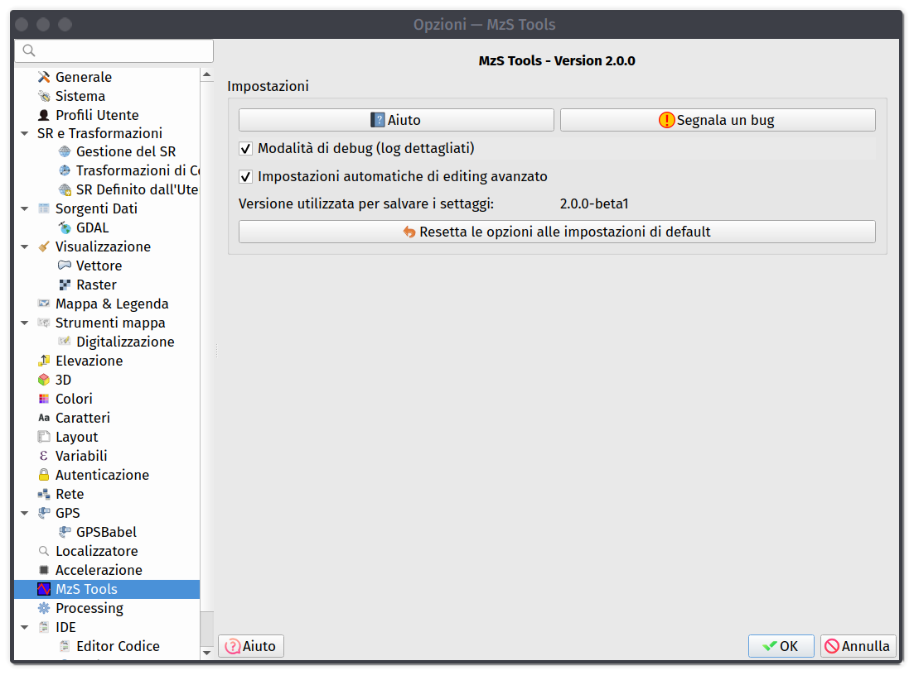

Altri strumenti
---------------

.. |ico2| image:: ../../../mzs_tools/resources/icons/ico_importa.png
  :height: 25

.. |ico3| image:: ../../../mzs_tools/resources/icons/ico_esporta.png
  :height: 25

.. |ico4| image:: ../../../mzs_tools/resources/icons/ico_edita.png
  :height: 25

.. |ico5| image:: ../../../mzs_tools/resources/icons/ico_salva_edita.png
  :height: 25

.. |ico6| image:: ../../../mzs_tools/resources/icons/ico_xypoint.png
  :height: 25

.. |ico7| image:: ../../../mzs_tools/resources/icons/mActionOptions.png
  :height: 25

.. |ico8| image:: ../../../mzs_tools/resources/icons/ico_info.png
  :height: 25

.. |ico9| image:: ../../../mzs_tools/resources/icons/mActionAddHtml.png
  :height: 25

.. _metadata-edit:

Inserimento e modifica dei metadati
"""""""""""""""""""""""""""""""""""

Lo strumento della toolbar *Modifica metadati di progetto* |ico9| consente di inserire e modificare i metadati del progetto.

Al momento della creazione di un nuovo progetto, il plugin MzSTools richiede di inserire alcuni dati di base, tra i quali il nome ed indirizzo email
dell'autore dello studio. Questi dati, insieme ad altri dati ricavati dal progetto, vengono inseriti in una tabella del database in modo conforme a quanto
definito negli **Standard MS**.

Tramite lo strumento *Modifica metadati di progetto* è possibile modificare i dati inseriti in fase di creazione del progetto, e inserire  o modificare
ulteriori informazioni.

.. image:: ../img/edit_metadata.png
  :width: 600
  :align: center

.. _controllo-allegati:

Controllo dei file allegati
"""""""""""""""""""""""""""

Le interfacce di inserimento dati del plugin MzSTools consentono di allegare file esterni (in particolare documenti,
file di testo) ad alcuni elementi (indagini, parametri, ecc.), come richiesto dagli Standard MS.

Quando si allega un documento, nel database viene memorizzato solo il **percorso** del file allegato, che pertanto
potrebbe anche essere collocato al di fuori della cartella del progetto.

.. Note::
   Si consiglia di copiare o spostare sempre i file da allegare all'interno della cartella del progetto, in modo da evitare problemi
   di collegamento ai file allegati in caso di spostamento del progetto o di condivisione dello stesso con altri utenti.

Lo strumento della toolbar *Controllo file allegati* consente di verificare la presenza e la correttezza dei
file allegati alle indagini ed ai parametri, controllandone il percorso memorizzato nel database e spostandoli
nella cartella "Allegati" del progetto se necessario.

.. image:: ../img/controllo_allegati.png
  :width: 520
  :align: center

I file possono essere opzionalmente rinominati in modo automatico aggiungendo ai nomi gli ID degli elementi a cui sono
collegati, in modo da facilitare la loro identificazione e permettere l'utilizzo dello :ref:`consultazione-allegati`.

E\' particolarmente utile eseguire il controllo dei file allegati *prima* di eseguire l\':ref:`esportazione`.

.. _plugin-settings:

Impostazioni di MzS Tools
"""""""""""""""""""""""""

Lo strumento “Impostazioni di MzS Tools”, attivabile tramite il pulsante |ico7| della toolbar, consente modificare
alcune impostazioni del plugin.

Attualmente è possibile attivare o disattivare l'impostazione automatica delle opzioni avanzate di editing per alcuni
layer del progetto (vedi: :ref:`auto-overlaps`) ed abilitare i messaggi di log dettagliati.

.. _plugin-deps:

Controllo delle dipendenze del plugin
"""""""""""""""""""""""""""""""""""""

Questo strumento consente di verificare che tutte le librerie Python e la Java Runtime Environment richiesti dal
plugin siano correttamente installati e funzionanti.
