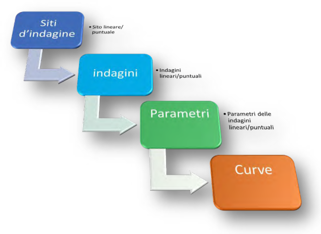
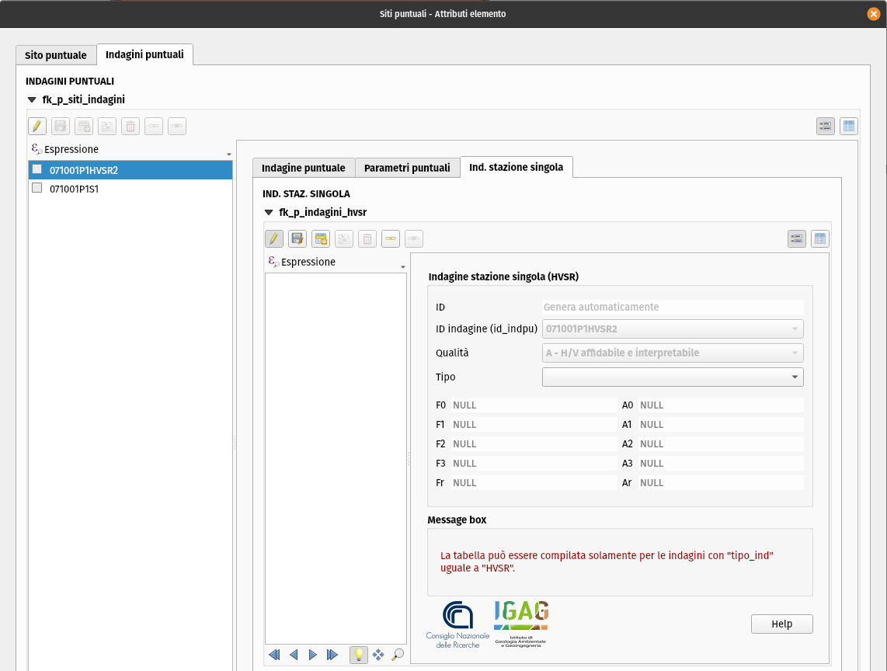
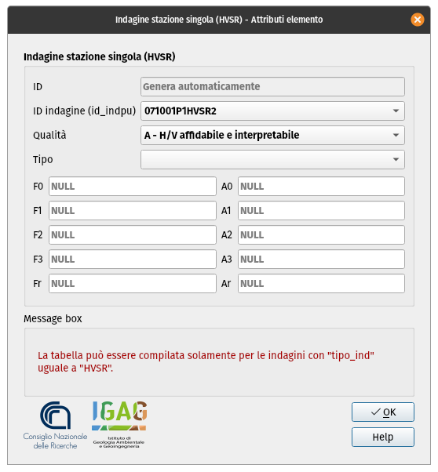
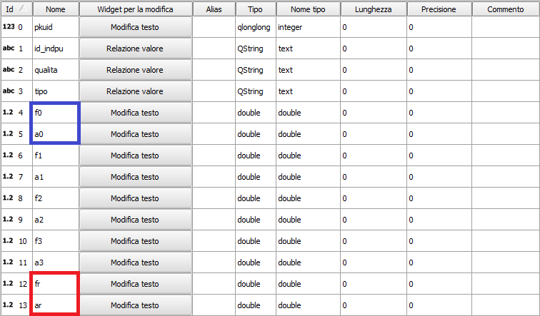

Inserimento dati ed editing
---------------------------

.. |ico4| image:: ../../../img/ico_edita.png
  :height: 25

Il plugin possiede alcuni strumenti che aiutano l’operatore nel disegno e nella creazione di nuovi oggetti secondo determinate regole topologiche preimpostate nel progetto.

La procedura per **inserire nuovi dati** consiste in:

* selezionare il layer da editare nel pannello dei layer di QGIS;
* attivare l’editing con lo strumento |ico4| della toolbar del plugin;
* disegnare su mappa la geometria dell’elemento;
* una volta conclusa la digitalizzazione (tramite il pulsante destro del mouse), QGIS aprirà automaticamente la maschera di inserimento degli attributi relativi alla geometria appena creata;
* dopo aver inserito gli attributi, premere il tasto “OK” della maschera di inserimento;
* per salvare, cliccare il tool del plugin “Save” |ico5|.

.. note:: È possibile attivare l’editing anche tramite le funzionalità native di QGIS, ma il pulsante |ico4| della toolbar di MzSTools consente di impostare automaticamente, per determinati layer, una configurazione di *snapping* che consente di evitare **errori topologici** quali intersezioni ed auto-intersezioni fra geometrie, anche di layer diversi, come indicato negli Standard MS.

Per **modificare gli attributi** di una feature già esistente, è possibile procedere in questo modo:

* selezionare il layer da editare;
  
  .. image:: ../img/editing1.png
      :width: 350
      :align: center

* attivare l’editing con:

  - lo strumento della toolbar di QGIS “Attiva modifiche”;
  - oppure lo strumento |ico4| della barra del plugin;

* "identificare" la feature da editare su mappa tramite lo strumento "Informazioni elementi" di QGIS;
  
  .. tip:: Per fare in modo che QGIS apra direttamente la maschera di inserimento, nel pannello “Informazioni risultati” mettere la spunta su “Apri modulo automaticamente”.
  
    .. image:: ../img/ident_maschera.png
        :width: 550
        :align: center

* all’interno della maschera, modificare i campi da aggiornare. La finestra di inserimento può essere più o meno articolata in base alla quantità di informazioni correlate alla geometria inserita;

  .. image:: ../img/editing2.png
      :width: 700
      :align: center

* per salvare le modifiche, cliccare su:

  * pulsante della toolbar di QGIS “Salva modifiche vettore”;
  * oppure pulsante della barra del plugin |ico5|.

Inserimento indagini puntuali e lineari
"""""""""""""""""""""""""""""""""""""""

Per le indagini puntuali e lineari è necessario inserire una notevole quantità di informazioni strutturate (sito, indagini, parametri), per cui in questo caso l’interfaccia di inserimento risulta più complessa, con menu a scelta multipla per i codici ed una serie di altri elementi grafici.

L'**inserimento o modifica di un sito di indagine** avviene secondo le modalità spiegate precedentemente.

Per l'**inserimento delle indagini associate ad un sito già inserito** si consiglia di procedere in questo modo:

* Selezionare il sito d’indagine con il pulsante “Informazioni risultati” di QGIS; si aprirà la maschera *Siti puntuali – attribuiti elementi*

* all'interno della maschera selezionare la scheda “Indagini Puntuali” (o Lineari)

  .. image:: ../img/siti_ind_param2.png
    :width: 840
    :align: center

* selezionare il pulsante *Attiva/disattiva modalità modifica per layer figlio* (1) e successivamente il pulsante *Aggiungi elemento figlio*, all’interno del tab “Indagini Puntuali”; si aprirà la finestra di inserimento delle informazioni dell'indagine;

* Premere il tasto *Salva modifiche layer figlio* per salvare l'indagine.

Inserimento parametri puntuali e lineari
""""""""""""""""""""""""""""""""""""""""

Una volta inserita almeno un'indagine per un sito puntuale o lineare, sarà possibile inserire i parametri associati all'indagine.

* selezionare il sito d’indagine con il pulsante *Informazioni elementi*; si aprirà la maschera *Siti puntuali – attribuiti elementi*;
* selezionare la scheda *Indagini Puntuali* (o Lineari) e successivamente selezionare il pulsante *Passa alla vista modulo*;

  .. image:: ../img/editing_vista_modulo.png
    :width: 600
    :align: center

* selezionare l'indagine dalla lista di indagini associate al sito, cliccare sulla scheda *Parametri* e sul pulsante *Passa alla vista modulo* ;
  
  .. image:: ../img/editing_param.png
    :width: 680
    :align: center

* selezionare il pulsante *Attiva/disattiva modalità modifica per layer figlio* e successivamente il pulsante *Aggiungi elemento figlio*, all’interno del tab Parametri Puntuali”; si aprirà la finestra di inserimento delle informazioni del parametro;

* selezionare il pulsante *Salva modifiche layer figlio* per salvare il parametro.

Inserimento delle "curve" associate ai parametri
""""""""""""""""""""""""""""""""""""""""""""""""

* selezionare il sito d’indagine su mappa tramite il pulsante di QGIS *Informazioni elementi*; si aprirà la maschera *Siti puntuali – attribuiti elementi*;
* selezionare la scheda *Indagini Puntuali* (o lineari) e successivamente selezionare il pulsante *Passa alla vista modulo*;
* selezionare la scheda *Parametri Puntuali* (o lineari) e successivamente selezionare il pulsante *Passa alla vista modulo*;
* selezionare la scheda *Curve di riferimento* e successivamente selezionare il pulsante *Passa alla vista modulo*;
* selezionare il pulsante *Attiva/disattiva modalità modifica per layer figlio* e successivamente il pulsante *Aggiungi elemento figlio*, all’interno del tab Parametri Puntuali”; si aprirà la finestra di inserimento delle informazioni del parametro;
* selezionare il pulsante *Salva modifiche layer figlio* per salvare il parametro.

.. _dati-hvsr:

Indagini a stazione singola
"""""""""""""""""""""""""""

Per le *indagini puntuali* di tipo ``HVSR`` è possibile inserire i dati riguardanti le **posizioni delle misure a stazione singola**, attraverso la scheda "Ind. stazione singola".

La struttura della banca dati HVSR prevede l’archiviazione di n. 4 valori di frequenze e relative ampiezze attraverso la maschera d’inserimento:

Le misure dei valori di rumore dovranno essere riportati nei campi F0, F1, F2 e F3 (Frequenze in Hz) e relative Ampiezze (/) A0, A1, A2, e A3.

Nel campo numerico F0 va riportato il valore f0 (Hz) con relativa ampiezza A0, nel campo F1 va riportato il valore di frequenza f1 con ampiezza A1 e così via a crescere in frequenza, per quanti sono i massimi significativi nella curva HVSR.

Nel campo numerico Fr e della relativa ampiezza Ar vanno riportati i valori di riferimento della Frequenza e dell’Ampiezza più rappresentative scelte tra F0, F1, F2, F3.

Per tale scopo sono state creati due :ref:`layout-stampa`: *Carta delle frequenze naturali dei terreni (F0)* e *Carta delle frequenze naturali dei terreni (Fr)*; il primo rappresenta la Carta delle frequenze naturali dei terreni basata sui valori di F0, il secondo rappresenta la Carta delle frequenze naturali dei terreni costruita sui valori di Fr.

Il valore ‘No Peak’ della misura si ottiene dando un valore nullo o ‘0’ (zero) al campo numerico F0 o Fr.

Per ulteriori informazioni sulla simbologia e sui layout cartografici per le stazioni singole: :ref:`layout-hvsr`