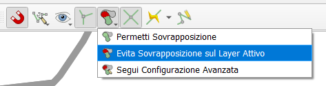

.. _editing:

Inserimento dati ed editing
---------------------------

Inserimento dati vettoriali e relativi attributi
""""""""""""""""""""""""""""""""""""""""""""""""

.. |ico-topo| image:: https://docs.qgis.org/3.34/it/_images/mIconTopologicalEditing.png
  :height: 25

Come descritto nella sezione :ref:`progetto-qgis`, il progetto generato dal plugin MzSTools è strutturato in gruppi di layer.

L\'**inserimento dei dati geografici vettoriali** necessari per lo studio di MS, secondo quanto definito dagli Standard, viene effettuato tramite i layer del gruppo
**Banca dati geografica**, utilizzando *gli strumenti di editing messi a disposizione da QGIS*.

MzS Tools associa agli strumenti di editing di QGIS una serie di *interfacce di inserimento dati personalizzate*
che aiutano nell'inserimento degli attributi e delle informazioni correlate alle geometrie.

La procedura generale per **inserire nuovi dati** consiste in:

* selezionare uno dei layer vettoriali del gruppo **Banca dati geografica** nel pannello dei layer di QGIS;
* attivare l’editing tramite lo strumento “Attiva modifiche” della toolbar di editing di QGIS;
* disegnare su mappa la geometria dell’elemento;
* una volta conclusa la digitalizzazione (tramite il pulsante destro del mouse), QGIS aprirà automaticamente
  la maschera di inserimento degli attributi relativi alla geometria appena creata; questa può essere più o meno
  articolata in base alla quantità di informazioni correlate alla geometria inserita;

  .. image:: ../img/editing2.png
      :width: 700
      :align: center

* dopo aver inserito gli attributi, premere il tasto “OK” della maschera di inserimento;
* per salvare, cliccare il pulsante “Salva modifiche” e selezionare nuovamente “Attiva modifiche” della toolbar di editing di QGIS per interrompere l'editing.

.. Tip:: Per approfondire consultare il `Manuale utente di QGIS <https://docs.qgis.org/3.34/it/docs/user_manual/working_with_vector/editing_geometry_attributes.html#digitizing-an-existing-layer>`_.

Per **modificare gli attributi** di una feature già esistente, è possibile procedere in questo modo:

* selezionare il layer da editare;
* attivare l’editing con lo strumento della toolbar di QGIS “Attiva modifiche”;
* "identificare" la feature da editare su mappa tramite lo strumento "Informazioni elementi" di QGIS;

  .. tip:: Per fare in modo che QGIS apra direttamente la maschera di inserimento, nel pannello “Informazioni risultati” mettere la spunta su “Apri modulo automaticamente”.

    .. image:: ../img/ident_maschera.png
        :width: 550
        :align: center

* all’interno della maschera, modificare i campi da aggiornare;

* per salvare le modifiche, cliccare sul pulsante della toolbar di QGIS “Salva modifiche vettore”.

Inserimento indagini puntuali e lineari
"""""""""""""""""""""""""""""""""""""""

Per le indagini puntuali e lineari è necessario inserire una notevole quantità di informazioni strutturate (sito, indagini, parametri), per cui in questo caso l’interfaccia di inserimento risulta più complessa, con menu a scelta multipla per i codici ed una serie di altri elementi grafici.

.. image:: ../img/siti_ind_param.png
  :width: 540
  :align: center

L'**inserimento o modifica di un sito di indagine** avviene secondo le modalità spiegate precedentemente.

Per l'**inserimento delle indagini associate ad un sito già inserito** si consiglia di procedere in questo modo:

* Selezionare il sito d’indagine con il pulsante “Informazioni risultati” di QGIS; si aprirà la maschera *Siti puntuali – attribuiti elementi*

* all'interno della maschera selezionare la scheda “Indagini Puntuali” (o Lineari)

  .. image:: ../img/siti_ind_param2.png
    :width: 840
    :align: center

* selezionare il pulsante *Attiva/disattiva modalità modifica per layer figlio* (1) e successivamente il pulsante *Aggiungi elemento figlio*, all’interno del tab “Indagini Puntuali”; si aprirà la finestra di inserimento delle informazioni dell'indagine;

* Premere il tasto *Salva modifiche layer figlio* per salvare l'indagine.

Inserimento parametri puntuali e lineari
""""""""""""""""""""""""""""""""""""""""

Una volta inserita almeno un'indagine per un sito puntuale o lineare, sarà possibile inserire i parametri associati all'indagine.

* selezionare il sito d’indagine con il pulsante *Informazioni elementi*; si aprirà la maschera *Siti puntuali – attribuiti elementi*;
* selezionare la scheda *Indagini Puntuali* (o Lineari) e successivamente selezionare il pulsante *Passa alla vista modulo*;

  .. image:: ../img/editing_vista_modulo.png
    :width: 600
    :align: center

* selezionare l'indagine dalla lista di indagini associate al sito, cliccare sulla scheda *Parametri* e sul pulsante *Passa alla vista modulo* ;

  .. image:: ../img/editing_param.png
    :width: 680
    :align: center

* selezionare il pulsante *Attiva/disattiva modalità modifica per layer figlio* e successivamente il pulsante *Aggiungi elemento figlio*, all’interno del tab Parametri Puntuali”; si aprirà la finestra di inserimento delle informazioni del parametro;

* selezionare il pulsante *Salva modifiche layer figlio* per salvare il parametro.

Inserimento delle "curve" associate ai parametri
""""""""""""""""""""""""""""""""""""""""""""""""

* selezionare il sito d’indagine su mappa tramite il pulsante di QGIS *Informazioni elementi*; si aprirà la maschera *Siti puntuali – attribuiti elementi*;
* selezionare la scheda *Indagini Puntuali* (o lineari) e successivamente selezionare il pulsante *Passa alla vista modulo*;
* selezionare la scheda *Parametri Puntuali* (o lineari) e successivamente selezionare il pulsante *Passa alla vista modulo*;
* selezionare la scheda *Curve di riferimento* e successivamente selezionare il pulsante *Passa alla vista modulo*;
* selezionare il pulsante *Attiva/disattiva modalità modifica per layer figlio* e successivamente il pulsante *Aggiungi elemento figlio*, all’interno del tab Parametri Puntuali”; si aprirà la finestra di inserimento delle informazioni del parametro;
* selezionare il pulsante *Salva modifiche layer figlio* per salvare il parametro.

.. _dati-hvsr:

Indagini a stazione singola
"""""""""""""""""""""""""""

Per le *indagini puntuali* di tipo ``HVSR`` è possibile inserire i dati riguardanti le **posizioni delle misure a stazione singola**, attraverso la scheda "Ind. stazione singola".

La struttura della banca dati HVSR prevede l’archiviazione di n. 4 valori di frequenze e relative ampiezze attraverso la maschera d’inserimento:

Le misure dei valori di rumore dovranno essere riportati nei campi F0, F1, F2 e F3 (Frequenze in Hz) e relative Ampiezze (/) A0, A1, A2, e A3.

Nel campo numerico F0 va riportato il valore f0 (Hz) con relativa ampiezza A0, nel campo F1 va riportato il valore di frequenza f1 con ampiezza A1 e così via a crescere in frequenza, per quanti sono i massimi significativi nella curva HVSR.

Nel campo numerico Fr e della relativa ampiezza Ar vanno riportati i valori di riferimento della Frequenza e dell’Ampiezza più rappresentative scelte tra F0, F1, F2, F3.

Per tale scopo sono state creati due :ref:`layout-stampa`: *Carta delle frequenze naturali dei terreni (F0)* e *Carta delle frequenze naturali dei terreni (Fr)*; il primo rappresenta la Carta delle frequenze naturali dei terreni basata sui valori di F0, il secondo rappresenta la Carta delle frequenze naturali dei terreni costruita sui valori di Fr.

Il valore ‘No Peak’ della misura si ottiene dando un valore nullo o ‘0’ (zero) al campo numerico F0 o Fr.

Per ulteriori informazioni sulla simbologia e sui layout cartografici per le stazioni singole: :ref:`layout-hvsr`

Strumenti di editing avanzato
"""""""""""""""""""""""""""""

QGIS mette a disposizione una serie di strumenti di editing avanzato che aiutano l’utente nella creazione e modifica di oggetti geografici corretti e coerenti
da un punto di vista geometrico, topologico e concettuale.

.. Tip:: Si consiglia la consultazione del `Manuale utente di QGIS <https://docs.qgis.org/3.34/it/docs/user_manual/working_with_vector/editing_geometry_attributes.html>`_ per tutte le informazioni.

In particolare sono presenti varie impostazioni che riguardano:

* `proprietà di aggancio (snapping): <https://docs.qgis.org/3.34/it/docs/user_manual/working_with_vector/editing_geometry_attributes.html#snapping-properties>`_
* `modifiche topologiche <https://docs.qgis.org/3.34/it/docs/user_manual/working_with_vector/editing_geometry_attributes.html#topological-editing>`_
* `digitalizzazione avanzata <https://docs.qgis.org/3.34/it/docs/user_manual/working_with_vector/editing_geometry_attributes.html#advanced-digitizing>`_
* `proprietà Digitalizzazione del layer <https://docs.qgis.org/3.34/it/docs/user_manual/working_with_vector/vector_properties.html#digitizing-properties>`_

Impostazioni di aggancio (snapping)
===================================

Le impostazioni di aggancio sono raggiungibili tramite il menu ``Progetto - Opzioni di Aggancio…``. E\' possibile inoltre attivare
la *Barra degli strumenti di aggancio* di QGIS, la quale dà accesso alla maggior parte di queste funzioni.

Editing topologico
==================

Oltre alle opzioni di aggancio, la finestra di dialogo ``Opzioni di aggancio…`` e la barra degli strumenti Aggancio… permettono di abilitare / disabilitare
alcune funzionalità topologiche, quali:

* **modifica topologica**: il pulsante |ico-topo| (*Abilita Modifica Topologica*) aiuta quando si modificano e si gestiscono elementi con confini comuni.
  Con questa opzione abilitata, QGIS «rileva» i confini comuni. Quando si spostano i vertici/segmenti comuni, QGIS li sposta anche nelle geometrie degli elementi vicini.
* **controllo delle sovrapposizioni** (*overlaps*): La sovrapposizione impedisce di disegnare nuovi elementi che si sovrappongono a quelli esistenti nel layer selezionato,
  velocizzando la digitalizzazione di poligoni adiacenti.

Altre opzioni di editing topologico sono disponibili nel pannello delle `proprietà Digitalizzazione del layer <https://docs.qgis.org/3.34/it/docs/user_manual/working_with_vector/vector_properties.html#digitizing-properties>`_:

E\' qui possibile attivare, a seconda del tipo di geometria del layer, alcuni **Controlli topologici** per *assicurare che le geometrie inserite nel layer rispettino determinate regole*, indipendentemente dalle impostazioni
di aggancio ed editing viste in precedenza.

* "Vuoto": impedisce la presenza di vuoti (*gaps*) tra un poligono e l'altro;
* "Vertice Mancante": controlla i confini condivisi dei poligoni vicini quando un confine manca di un vertice presente sull’altro;
* "Sovrappone": impedisce le sovrapposizioni tra i poligoni vicini.

Si possono inoltre impostare altri controlli quali:

* Correzione automatica dei nodi duplicati;
* Controllo della validità delle geometrie; ad esempio, nel caso dei poligoni, questa opzione evita che si possano verificare problemi quali
  la "auto-intersezione".

.. _auto-overlaps:

Controllo delle sovrapposizioni tra layer diversi
=================================================

L'impostazione di base per il controllo delle sovrapposizioni tra poligoni è "Evita sovrapposizione sul layer attivo", che impedisce la sovrapposizione
tra elementi poligonali appartenenti allo stesso layer.

In alcuni casi può essere utile attivare l'opzione **"Segui configurazione avanzata"**, che permette di impostare regole di sovrapposizione
tra i poligoni appartenenti a *layer diversi*.

Nel caso della Microzonazione Sismica è ad esempio utile fare in modo che non vi siano sovrapposizioni tra i layer delle zone stabili e instabili.
L'impostazione, in questo caso, dovrebbe avvenire come mostrato in figura:

Come segnalato nel `manuale di QGIS <https://docs.qgis.org/3.34/it/docs/user_manual/working_with_vector/editing_geometry_attributes.html#overlapping-control>`_,
questa impostazione è da usare con cautela in quanto si potrebbero ottenere geometrie inaspettate nel caso ci si dimentichi di deselezionare questa opzione
quando non è più necessaria.

Per questo motivo **MzS Tools effettua automaticamente l'impostazione di alcune opzioni di editing avanzato** nel momento in cui
si attiva l'editing per determinati layer:

* attivazione dell'opzione "Segui configurazione avanzata" per il controllo delle sovrapposizioni tra layer
  appartenenti ad uno stesso "gruppo" (ad esempio i layer delle zone stabili e instabili del livello 1 o del livello 2-3);
* attivazione dell'opzione "Modifica topologica" per facilitare l'editing dei poligoni aventi confini in comune ed
  evitare la presenza di vuoti tra l'uno e l'altro.

Le opzioni vengono poi **automaticamente riportate allo stato iniziale salvato nel progetto** nel momento in cui si
interrompe l'editing.

In questo modo si evitano errori topologici garantendo la corretta gestione delle sovrapposizioni tra i layer che lo
richiedono, senza però interferire con le impostazioni personali effettuate a livello di progetto.

Questo comportamento automatico può comunque essere disattivato o riattivato tramite lo strumento di configurazione di
MzS Tools (vedi: :ref:`plugin-settings`):
