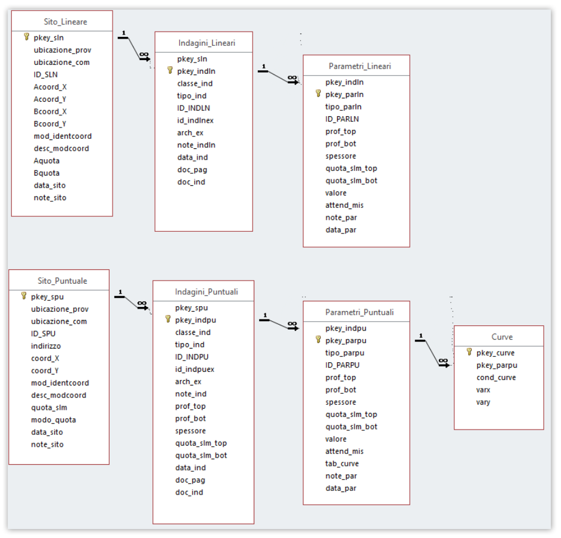
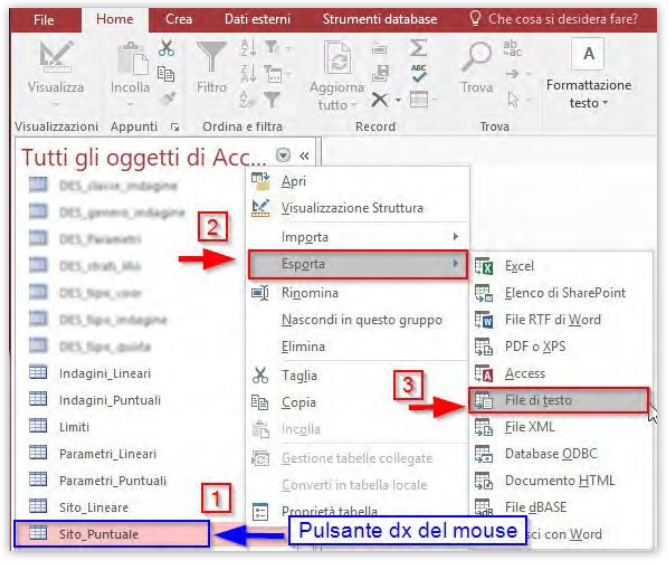
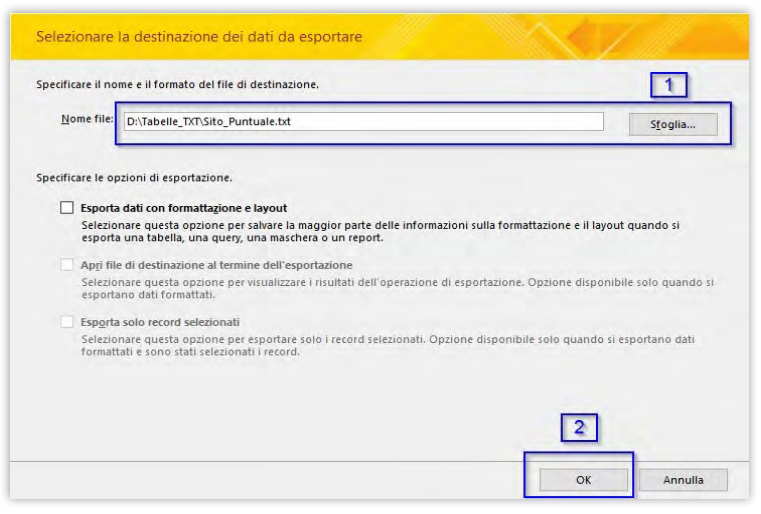
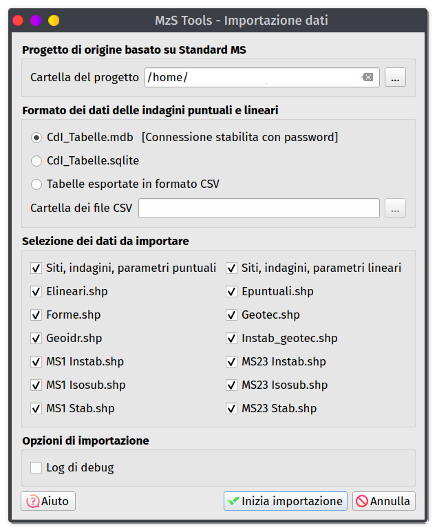

.. _importazione:

Importazione dati da un progetto standard
-----------------------------------------

.. |ico1| image:: ../../../img/ico_nuovo_progetto.png
  :height: 25

Nel caso in cui il nuovo studio di MS costituisca il proseguimento o approfondimento di uno studio già esistente - ad esempio quando il nuovo studio tratti un approfondimento di livello 3 precedentemente non effettuato - è possibile importare i dati già esistenti, e procedere successivamente alle integrazioni.

.. warning:: La procedura di importazione dei dati preesistenti deve essere effettuata all'interno di un **progetto MzSTools appena creato** (per lo stesso comune oggetto di studio), non modificato ed in cui non siano stati ancora inseriti dati.

   Inoltre il progetto dal quale effettuare l'importazione deve essere basato sugli **standard versione 4 o successive** e deve utlizzare il formato **shapefile** per i dati georeferenziati ed il **database Access “CdI_tabelle.mdb”**

In particolare, lo strumento è in grado di trasferire in modo automatico nella nuova struttura del plugin:

* i dati provenienti dagli **shapefile** e dal **database Access “CdI_tabelle”** con estensione “.mdb” del vecchio progetto;
* i **documenti** (ad esempio le carte in formato ``.pdf`` e i file degli spettri elastici di risposta in formato ``.txt``) presenti nelle cartelle accessorie del vecchio progetto. 

.. Note:: Per l’importazione dei dati dal database Access è necessario eseguire manualmente alcune operazioni di preparazione descritte di seguito.

La procedura di importazione è costituita quindi da 3 operazioni principali:

1. aprire il file **“CdI_Tabelle.mdb”** con Microsoft Access ed **esportare in formato .txt** le tabelle fondamentali di progetto;
2. creare un nuovo progetto mediante il tool **Nuovo progetto** |ico1| e lasciarlo aperto all’interno di QGIS (il progetto non deve essere editato e le feature class all'interno del geodatabase devono essere vuote);
3. eseguire il tool **Importa dati da un progetto esistente** |ico2|.

Esportazione dei dati da Microsoft Access
"""""""""""""""""""""""""""""""""""""""""

Prima di eseguire il tool di importazione è necessario esportare in formato ``.txt`` alcune tabelle del database Access **“CdI_Tabelle.mdb”**, e collocare i file esportati in una singola cartella (esterna al progetto MS).

Le tabelle da esportare da “CdI_Tabelle.mdb” sono:

* “Sito_Puntuale”;
* “Sito_Lineare”;
* “Indagini_Puntuali”;
* “Indagini_Lineari”;
* “Parametri_Puntuali”;
* “Parametri_Lineari”;
* “Curve”.

La procedura da eseguire per esportare le suddette tabelle in formato ``.txt``, è la seguente:

1. aprire la cartella principale del progetto da importare;

2. entrare nella cartella “Indagini” e aprire il “CdI_Tabelle.mdb” con Microsoft Access (versione Microsoft Office 2013 e successive);
   
3. selezionare una delle tabelle da esportare, premere il pulsante destro del mouse e selezionare **Esporta - File di testo**;
    

4. si aprirà la finestra “Esporta – File di testo” dove verrà richiesto di selezionare la directory di salvataggio e il nome del file TXT di output. Lasciare invariato il nome di default del file (nell’esempio “Sito_Puntuale.txt”) e selezionare la cartella di destinazione. Lasciare inalterate le altre opzioni e premere il pulsante “OK”;

   
5. si aprirà la finestra “Esportazione guidata testo”:
  
   a. nel primo step, spuntare la voce “Delimitato” e premere il pulsante “Avanti”;

      .. image:: ../img/esportazione3_access.png
        :width: 540
        :align: center

   b. nel secondo step, scegliere “Punto e virgola” all’interno del “Delimitatore campo”, spuntare la voce “Includi nomi di campo nella prima riga” e controllare che in “Qualificatore testo” siano selezionate le doppie virgolette. Premere il pulsante “Avanzate”;

      .. image:: ../img/esportazione4_access.png
        :width: 540
        :align: center

   c. si aprirà la finestra “Avanzate…”. Alla voce “Separatore decimale”, immettere “.” (punto). Premere il pulsante “OK”;

      .. image:: ../img/esportazione5_access.png
        :width: 540
        :align: center

   d. Si tornerà alla finestra “Esportazione guidata testo”. Premere il pulsante “Avanti”;

   e. nel terzo step, verrà visualizzata nuovamente la directory di output. Premere il pulsante “Fine”;

      .. image:: ../img/esportazione6_access.png
        :width: 540
        :align: center

6. ripetere le operazioni 4 e 5 per tutte le tabelle elencate precedentemente.

Esecuzione dello strumento di importazione
""""""""""""""""""""""""""""""""""""""""""

Dopo aver esportato le tabelle Access:

1. creare un **nuovo progetto** con MzSTools per il comune oggetto di studio e lasciarlo aperto all'interno di QGIS;
2. eseguire lo strumento **Importa dati da un progetto esistente** |ico2|

La finestra dello strumento è caratterizzata dalla presenza di due campi:

* “Cartella progetto”: Inserire la cartella del progetto da importare, ossia il percorso e il nome della cartella principale del progetto conforme agli Standard MS;
* “Cartella file TXT”: Inserire la cartella di salvataggio dei file in formato ``.txt``.

Dopo aver selezionato le cartelle, premere su "Ok" per avviare l'importazione dei dati.

.. note:: Al termine, il tool genera un *report* sull’esito dell’operazione di importazione. Tale documento viene salvato automaticamente nel seguente percorso: ``nome_comune\allegati\log``. Il nome del report sarà caratterizzato dalla data e dall’ora di esecuzione del tool, e dalla la dicitura “import_log” (esempio: ``2018-06-13_09-06- 23_import_log.txt``).

.. warning:: I record degli shapefile “Stab” ed “Instab” da importare, presenti nella cartella “MS23”, che possiedono un valore del campo “Livello” diverso da “2” o da “3”, non verranno copiati. Pertanto, prima di avviare il tool, eseguire un controllo dei suddetti file.
