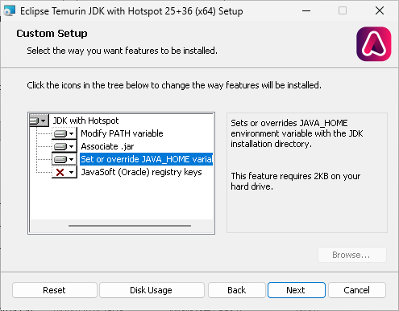

Installazione
-------------

Per installare MzS Tools è necessario selezionare, tramite il menu **plugin**, la voce **"Gestisci e installa plugin…"**.

.. important:: Il plugin è compatibile esclusivamente con **QGIS versione 3.26** o successive. E\' consigliabile
  scaricare (ed aggiornare regolarmente) l'ultima versione **LTR** (*long term release*) disponibile sul
  `sito ufficiale <https://qgis.org/it/site/forusers/download.html>`_.

Successivamente cliccare sulla scheda **"Non Installati"** e digitare, all'interno della barra di ricerca, il nome del
plugin: "MzS Tools". QGIS mostrerà una lista dei *plugin* presenti con le parole chiavi digitate: selezionare "MzS
Tools" all’interno dell'elenco e premere il pulsante **"Installa Plug-in"**.

Componenti aggiuntive
"""""""""""""""""""""

Le funzionalità di importazione ed esportazione dati di MzS Tools da/verso database Microsoft Access (database *"CdI_Tabelle.mdb"*
definito dagli Standard MS), richiedono l'installazione di alcune componenti aggiuntive:

- una release recente di Java runtime environment (JRE o JDK versione 11 o successiva) a **64 bit** installata sul sistema operativo;
- driver JDBC per Access (`UcanAccess <https://github.com/spannm/ucanaccess>`_) (incluso nel plugin);
- librerie Python (`JayDeBeApi <https://github.com/baztian/jaydebeapi>`_) per l'accesso alle funzionalità Java,
  installate tramite lo strumento integrato del plugin (vedi: :ref:`plugin-deps`) oppure tramite il plugin per QGIS `QPIP
  <https://github.com/opengisch/qpip>`_ (da installare separatamente).

.. _installazione-java:

Installazione di Java
"""""""""""""""""""""

Per abilitare le funzionalità del plugin che richiedono l'accesso ai database in formato Microsoft Access, è necessario
installare una versione recente di Java Runtime Environment (JRE o JDK) a **64 bit** sul sistema operativo.

.. Attention:: La versione 8 di Java disponibile sul sito `www.java.com <https://www.java.com/it/download/>`_ **NON è
  compatibile** con il driver JDBC UcanAccess, che dalla versione 5.1.0 richiede **Java 11 o superiore**. Si consiglia
  di scaricare una versione recente di OpenJDK (free ed open source) tramite ad esempio il sito `Adoptium <https://adoptium.net/>`_,
  oppure la `JDK Oracle <https://www.oracle.com/java/technologies/downloads/>`_ (licenza NFTC).

Dopo aver installato la JDK o JRE, potrebbe essere necessario impostare la variabile di ambiente di sistema
``JAVA_HOME`` con il percorso della cartella di installazione (ad es. ``C:\Program Files\Eclipse
Adoptium\jre-25.0.0.36-hotspot\``).

Durante l'installazione dei pacchetti per Windows scaricati da `Adoptium <https://adoptium.net/>`_, è possibile
selezionare un'opzione per l'impostazione automatica della variabile di ambiente ``JAVA_HOME``:

In alternativa, se si è sicuri di aver installato correttamente la JRE ma questa non viene rilevata dal plugin, è
possibile impostare manualmente il percorso della cartella di installazione di Java nelle impostazioni
(vedi: :ref:`plugin-settings`).

Controllo ed installazione delle dipendenze del plugin
""""""""""""""""""""""""""""""""""""""""""""""""""""""

Installazione librerie Python
'''''''''''''''''''''''''''''

Per installare le librerie Python richieste è possibile utilizzare lo strumento integrato :ref:`plugin-deps`.

.. image:: ../img/plugin_deps_02.png
    :width: 525
    :align: center

Questo strumento consente di rilevare ed installare automaticamente le librerie mancanti, oltre ad effettuare un
controllo della corretta installazione della Java Runtime Environment.

.. image:: ../img/plugin_deps_04.png
    :width: 525
    :align: center

Per maggiori dettagli sull'utilizzo dello strumento, vedere la sezione :ref:`plugin-deps`.

Installazione librerie Python con QPIP
''''''''''''''''''''''''''''''''''''''

In alternativa allo strumento integrato, è possibile utilizzare il plugin per QGIS
`QPIP <https://github.com/opengisch/qpip>`_.

Controllare nel gestore dei plugin di QGIS che il plugin **QPIP** sia installato e attivo.

.. Tip:: Dopo aver installato QPIP potrebbe essere necessario riavviare QGIS.

Al riavvio, utilizzare lo strumento *"Run dependencies check"* di QPIP per installare le librerie Python richieste da MzS Tools.

.. image:: ../img/qpip_02.png
  :align: center

Installazione versione di sviluppo
""""""""""""""""""""""""""""""""""

E\' possibile installare l'ultima versione di sviluppo di MzS Tools utilizzando il repository definito all'indirizzo:

.. code-block::

  https://cnr-igag.github.io/mzs-tools/plugins.xml

Nel gestore dei plugin di QGIS:

* selezionare la voce **"Impostazioni"**;
* abilitare la voce **"Mostra anche Plugin Sperimentali"**;
* cliccare sul pulsante **"Aggiungi…"**;
* inserire un nome per il repository (ad es. "MzS Tools dev"), la URL indicata sopra e premere **"OK"**.

.. Attention:: La versione di sviluppo potrebbe contenere funzionalità non ancora completamente testate e potenzialmente
  instabili. Si consiglia di utilizzare la versione di sviluppo solo per test.
