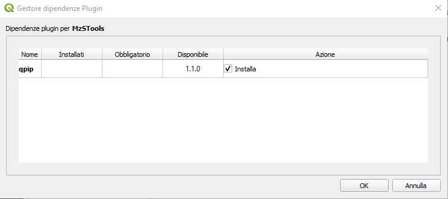
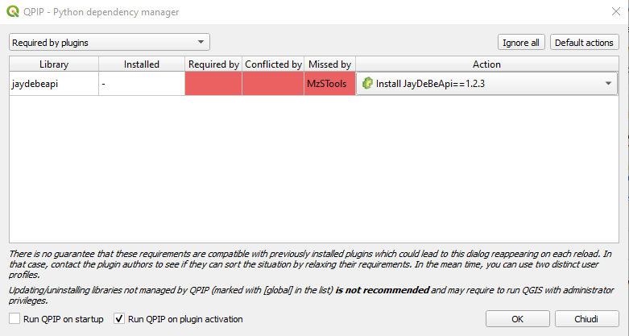

Installazione
-------------

Per installare MzS Tools è necessario selezionare, tramite il menu **plugin**, la voce **"Gestisci e installa plugin…"**.

.. important:: Il plugin è compatibile esclusivamente con **QGIS versione 3.26** o successive. E\' consigliabile
  scaricare (ed aggiornare regolarmente) l'ultima versione **LTR** (*long term release*) disponibile sul 
  `sito ufficiale <https://qgis.org/it/site/forusers/download.html>`_.

Successivamente cliccare sulla scheda **"Non Installati"** e digitare, all'interno della barra di ricerca, il nome del
plugin: "MzS Tools". QGIS mostrerà una lista dei *plugin* presenti con le parole chiavi digitate: selezionare "MzS
Tools" all’interno dell'elenco e premere il pulsante **"Installa Plug-in"**.

.. Attention:: Per il corretto funzionamento delle maschere di inserimento si raccomanda di spuntare l’opzione 
  **“Abilita macro” → Sempre** nelle **Impostazioni di QGIS → Opzioni → File Progetto**
    
  .. image:: ../img/qgis_macro.png
    :width: 800
    :align: center

Componenti aggiuntivi
""""""""""""""""""""" 

Le funzionalità di importazione ed esportazione dati da/verso database Microsoft Access (database *"CdI_Tabelle.mdb"*
definito dagli Standard MS) di MzS Tools, richiedono l'installazione di alcuni componenti aggiuntivi:

- una release recente di Java runtime environment (JRE o JDK) a **64 bit** installata sul sistema operativo;
- la presenza di un driver JDBC per Access (`UcanAccess <https://ucanaccess.sourceforge.net/site.html>`_) (incluso nel plugin);
- librerie Python per l'accesso alle funzionalità Java, installate tramite il plugin per QGIS `QPIP <https://github.com/opengisch/qpip>`_.

Installazione di Java
"""""""""""""""""""""

E\' necessario installare una versione recente di Java runtime environment (JRE o JDK) **64 bit** sul sistema operativo.

.. Attention:: La versione 8 di Java disponibile sul sito `Oracle <https://www.java.com/it/download/>`_ **NON è
  compatibile** con il driver JDBC UcanAccess. Si consiglia di scaricare una versione recente di OpenJDK (free ed open source)
  tramite ad esempio il sito `Adoptium <https://adoptium.net/>`_.

Installazione librerie Python con QPIP
""""""""""""""""""""""""""""""""""""""

Per installare le librerie Python necessarie per l'accesso alle funzionalità Java, è possibile utilizzare il plugin per QGIS
`QPIP <https://github.com/opengisch/qpip>`_.

Durante l'installazione di MzS Tools, QGIS richiederà di installare le **dipendenze** necessarie per il corretto
funzionamento:

|

Controllare nel gestore dei plugin di QGIS che il plugin **QPIP** sia installato e attivo.

.. Tip:: Dopo aver installato QPIP potrebbe essere necessario riavviare QGIS. 

Al riavvio, QPIP chiederà automaticamente di installare le librerie Python richieste da MzS Tools. 

|