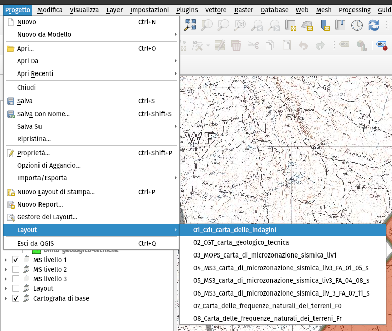

.. _layout-stampa:

Layout di stampa
----------------

Durante la creazione di un nuovo progetto, il plugin MzSTools genera una struttura di progetto specifica per il comune oggetto dello studio.

Il file di progetto QGIS, oltre ad avere memorizzati i percorsi, le etichette e gli stili di rappresentazione dei layer, presenta al suo interno una serie di **layout di stampa** preimpostati per i diversi prodotti cartografici richiesti dagli Standard MS.

Anche questi layout vengono personalizzati sulla base delle informazioni immesse durante la fase di creazione del progetto, ed in larga parte sono preimpostati secondo le indicazioni fornite dagli standard, ad esempio riguardo le dimensioni della mappa e di altri elementi grafici.

Per poter operare sui layout di stampa, è necessario:

* **attivare i layer contenuti nel group layer “Layout”**, i quali sono specificamente impostati per la restituzione cartografica;
* **disattivare gli altri gruppi di layer** utilizzati per l’inserimento e l’editing dei dati.

.. note:: In questo modo, all’interno dei layout i layer vengono organizzati e visualizzati secondo criteri specificamente indirizzati alla cartografia; ad esempio, per le indagini puntuali, viene attivata una visualizzazione secondo lo stile *“spostamento punto”*, che consente di distinguere le diverse indagini associate ad ogni sito.

I layout di stampa sono accessibili dal menu **“Progetto – Layout”**. Selezionando uno dei layout viene aperta la finestra del compositore, in cui è possibile personalizzare manualmente alcuni elementi, quali ad esempio gli spazi testuali, ed aggiornare la legenda sulla base degli elementi effettivamente visibili su mappa.

.. _layout-hvsr:

Layout per le stazioni singole HVSR
"""""""""""""""""""""""""""""""""""

La simbologia della Carta delle frequenze naturali dei terreni è rappresentata dal range dei valori di picco massimo F (Hz) e dall'ampiezza del rapporto HVSR per i punti di misura.

Per la rappresentazione cartografica dei dati (descritti in :ref:`dati-hvsr`) sono stati creati due distinti layout:

* *Carta delle Frequenze Naturali dei Terreni (F0)*, per rappresentare i valori di F0 e relative ampiezze;
* *Carta delle Frequenze Naturali dei Terreni (Fr)*, per rappresentare il valore di frequenza più rappresentativo con relativa ampiezza.

La legenda del frontespizio cartografico è statica ed è applicabile nei range di valori riportati nei layout.
