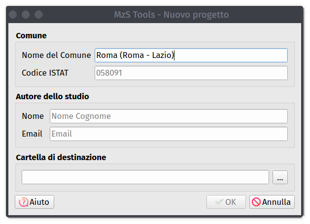

.. _nuovo-progetto:

Creazione di un nuovo progetto
------------------------------

.. |ico1| image:: ../../../img/ico_nuovo_progetto.png
  :height: 25

Il primo strumento, **Nuovo progetto**, permette di generare un progetto QGIS ed uno spazio di archiviazione adatti ad un **comune** oggetto di studio. 

|

Dopo aver selezionato il pulsante “Nuovo progetto” |ico1|, viene aperta una finestra contenente una serie di campi da compilare con informazioni relative a:

* il Comune oggetto degli studi: cominciare a digitare il nome del comune e selezionare uno dei risultati della ricerca;
* il nome e cognome dell'autore dello studio;
* un indirizzo email di riferimento dell'autore dello studio;
* la cartella di destinazione del progetto: cliccare sul pulsante "..." e selezionare una cartella sul proprio PC.

.. Note:: Con la selezione del comune oggetto di studio, il plugin esegue una serie di impostazioni fondamentali del progetto: il **database** viene predisposto, tramite viste (tabelle “virtuali” basate su query SQL), al filtraggio dei dati in base al comune, e sia la **mappa** principale di QGIS che i **layout di stampa** vengono automaticamente centrati ed impostati ad un livello di zoom opportuno. 
    
  Vengono inoltre compilati alcuni dei **metadati** di base del progetto previsti dagli Standard MS. Questi possono essere in seguito modificati e completati utilizzando lo strumento della toolbar :ref:`metadata-edit`

Dopo aver compilato tutti i campi richiesti, il pulsante “OK” risulterà selezionabile e verrà creata la struttura del progetto nella cartella selezionata.

Il tool, infine, aprirà automaticamente il progetto all'interno di QGIS ed eseguirà uno zoom all'estensione dell'area di studio del comune.

.. Tip:: È molto importante selezionare una cartella vuota, e successivamente avere cura di mantenerne il contenuto inalterato, effettuando periodicamente copie di backup in modo da poter ripristinare il progetto nell’eventualità di perdite di dati o altre modifiche accidentali.

Struttura di archiviazione
==========================

La cartella di lavoro generata dallo strumento è caratterizzata da una serie di file e sottocartelle:

* file **progetto_MS.qgs**: progetto QGIS; 
* cartella **allegati**: questa cartella può essere utilizzata dall’operatore per archiviare tutti i dati accessori al progetto, come, ad esempio, le carte di output richieste dagli Standard in formato “.pdf”, i file raster delle basemap da caricare nel progetto e i file degli spettri elastici di risposta in formato “.txt”. Sono presenti, inoltre, diverse sottocartelle nelle quali archiviare i file allegati;
* cartella **db**: in questa cartella è collocato il geodatabase di progetto in formato .sqlite; 
* cartella **progetto**: all’interno di questa cartella sono presenti una serie di file necessari al corretto funzionamento del progetto (ad esempio, script, file di definizione delle interfacce grafiche, loghi ed immagini) e che, pertanto, non devono essere modificati dall’utente.

.. Note:: È importante sottolineare il fatto che questa struttura di archiviazione non corrisponde esattamente a quella prevista dagli Standard, in quanto è ottimizzata per l’utilizzo con QGIS ed il plugin MzSTools. La generazione di una struttura conforme agli Standard deve quindi essere considerata come fase finale del flusso di lavoro e può essere eseguita tramite l'apposito strumento di esportazione.

Uno dei file più importanti all’interno della cartella di progetto è il file di progetto QGIS **progetto_MS.qgs**. Questo è il file all’interno del quale viene salvato lo “stato” del progetto, e pertanto contiene informazioni sui layer caricati, sulle simbologie applicate ai dati, i collegamenti alle tabelle del geodatabase, ma anche elementi come le connessioni agli script e alle finestre grafiche, nonché ai layout di stampa. Come per il resto della struttura di archiviazione, è molto importante preservare l’integrità di questo file.  

.. _progetto-qgis:

Il progetto QGIS
================

Gli elementi principali del progetto QGIS possono essere identificati in:

* **struttura dei layer** del progetto, rappresentata nel “Pannello dei Layer” (o "TOC" - *table of contents*) di QGIS; i layer presenti all’interno di questi gruppi non devono subire modifiche alle impostazioni di stile e simbologia, alla struttura della tabella degli attributi, ai join e/o relazioni.

  .. Note:: I layer del gruppo **Carta di Microzonazione Sismica** contengono regole di stile e filtri specifici per la composizione dei layout di stampa, e vanno quindi utilizzati solo in fase di generazione delle carte. Nel gruppo **“Cartografia di base”** sono precaricati alcuni layer di utilità quali i limiti comunali ed alcuni servizi WMS, ma è possibile aggiungerne altri in base alle esigenze di progetto;

* **toolbar** del plugin MzSTools; come tutte le barre degli strumenti di QGIS, questa può essere visualizzata o nascosta utilizzando il menu “Visualizza – Barre degli strumenti”;

* **interfacce di inserimento dati**: per ogni layer all’interno del quale è previsto l’inserimento dati, sono impostate una serie di funzionalità di QGIS che permettono al software di utilizzare interfacce grafiche semplificate e guidate per l’inserimento delle informazioni alfanumeriche relative alle geometrie selezionate in fase di editing. E’ quindi importante non modificare queste impostazioni dei layer per non perdere le funzionalità di inserimento;

* **layout di stampa**: per i principali output cartografici dello studio sono predisposti una serie di layout di stampa di QGIS, accessibili tramite il menu “Progetto – Layout”. Selezionando uno dei layout viene aperta una nuova finestra contenente un layout di stampa in larga parte già impostato con gli elementi grafici principali descritti negli Standard MS.

.. figure:: ../img/layout_stampa.png
  :width: 774
  :align: center

|

Il progetto QGIS per uno studio di MS creato da MzS Tools contiene una serie di **layer organizzati in gruppi**.

I gruppi di layer principali del progetto sono:

* **Banca dati geografica**
* **Carta di Microzonazione Sismica**
* **Cartografia di base**

.. warning:: Il layer di questi gruppi non devono essere rimossi, rinominati o spostati, in quanto il plugin MzS Tools si basa su questa struttura per il corretto funzionamento.

Il primo gruppo (**"Banca dati geografica"**) è costituito dai layer di tipo vettoriale che contengono le geometrie di diversi elementi del progetto 
(Siti puntuali, Siti lineari, Zone stabili, Zone instabili, ecc.).

L\'**inserimento dei dati geografici vettoriali** necessari per lo studio di MS, secondo quanto definito dagli Standard MS, viene effettuato tramite i layer di questo gruppo
utilizzando *gli strumenti di editing standard messi a disposizione da QGIS*. MzS Tools associa agli strumenti di editing di QGIS delle *interfacce di inserimento dati
personalizzate* che aiutano nell'inserimento degli attributi e delle informazioni correlate alle geometrie.

Il secondo gruppo di layer (**"Carta di Microzonazione Sismica"**) è invece costituito dai layer che fanno parte dei *layout di stampa* del progetto, 
e che vengono quindi utilizzati per la creazione delle carte tematiche previste dagli Standard MS.

I layer di questo gruppo sono caratterizzati da opportuni sistemi di filtraggio dei dati e dalla presenza della simbologia prevista dagli Standard MS,
e *non devono essere utilizzati per l'editing* (sono infatti impostati in sola lettura all'interno delle opzioni del progetto): :ref:`layout-stampa`

Il terzo gruppo di layer (**"Cartografia di base"**) contiene i layer di tipo raster e vettoriale che costituiscono la base cartografica del progetto.

.. Warning:: È possibile aggiungere layer (ad esempio è sicuramente utile aggiungere mappe di base come la cartografia CTR del comune oggetto di studio) 
  ed altri collegamenti come layer WMS (Web Map Services), ed è importante salvare il progetto al termine di una sessione di lavoro. Bisogna però avere 
  cura di *non eliminare o modificare i layer già presenti* nel progetto subito dopo averlo generato: in questo modo infatti si potrebbero perdere i 
  collegamenti agli script ed alle interfacce di inserimento necessarie per il funzionamento di diversi strumenti messi a disposizione dal plugin.

   In generale, si raccomanda di:

   * non spostare i file di progetto dalle loro cartelle;
   * non modificare nome della cartella di progetto, delle sue sotto-cartelle, del database e/o dei file che costituiscono il progetto;
   * non modificare il nome dei layer del progetto QGIS;
   * non modificare il nome dei layout di stampa del progetto QGIS.
