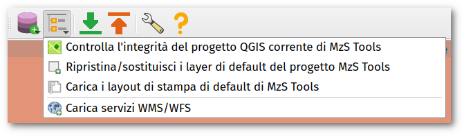

Strumenti del plugin
--------------------

Toolbar
"""""""

All'attivazione del plugin MzS Tools viene visualizzata nell'interfaccia di QGIS una **toolbar** contenente una serie di strumenti:

.. Note:: Se la toolbar non è presente nell'interfaccia di QGIS, è possibile riattivarla tramite il menu **Visualizza → Barre degli strumenti**.

Gli strumenti richiamabili tramite la toolbar sono:

.. |ico1| image:: ../../../mzs_tools/resources/icons/ico_nuovo_progetto.png
  :height: 25

.. |ico2| image:: ../../../mzs_tools/resources/icons/ico_importa.png
  :height: 25

.. |ico3| image:: ../../../mzs_tools/resources/icons/ico_esporta.png
  :height: 25

.. |ico4| image:: ../../../mzs_tools/resources/icons/ico_edita.png
  :height: 25

.. |ico6| image:: ../../../mzs_tools/resources/icons/ico_xypoint.png
  :height: 25

.. |ico8| image:: ../../../mzs_tools/resources/icons/ico_info.png
  :height: 25

|ico1| **Strumenti per la gestione del progetto**: Questo menu contiene gli strumenti per la creazione di un nuovo
progetto, per l'apertura di un progetto esistente, strumenti di gestione dei backup e degli allegati e per la modifica
dei metadati del progetto.

|ico9| **Strumenti di gestione dei layer**: Questo menu contiene alcuni strumenti per la gestione dei layer e dei layout di stampa del progetto QGIS.

|ico2| **Importa dati da un progetto esistente** → :ref:`importazione`

|ico3| **Esporta dati in una struttura di progetto standard** → :ref:`esportazione`

|ico7| **Strumenti di utilità** → :ref:`plugin-settings`

Strumenti di gestione del progetto
""""""""""""""""""""""""""""""""""

.. image:: ../img/plugin_toolbar_project_menu.png
  :width: 350
  :align: center

- **Nuovo progetto**: avvia la procedura guidata per la creazione di un nuovo progetto MzS Tools. Vedi: :ref:`nuovo-progetto`
- **Apri un progetto basato su 'Standard MS'**: questo strumento permette di importare uno studio di MS esistente, la
  cui struttura sia conforme agli Standard MS. Lo strumento crea un nuovo progetto MzS Tools per il comune indicato e
  successivamente avvia in modo automatico l'importazione dei dati.
- **Backup database**: effettua il backup del solo database del progetto corrente.
- **Backup progetto**: effettua il backup completo del progetto corrente.
- **Controllo dei file allegati**: avvia lo strumento di controllo dei file allegati. Vedi: :ref:`controllo-allegati`
- **Modifica i metadati del progetto**: apre la finestra di modifica dei metadati del progetto. Vedi: :ref:`metadata-edit`

Strumenti di gestione dei layer
"""""""""""""""""""""""""""""""

- **Controlla l'integrità del progetto QGIS corrente di MzS Tools**: esegue un controllo su diversi aspetti del progetto
  QGIS corrente, verificando la presenza di eventuali errori o incongruenze che potrebbero influire sul corretto
  funzionamento del plugin.
- **Ripristina/Sostituisci i layer di default del progetto MzS Tools**: in caso di problemi rilevati a livello dei
  layer fondamentali del progetto (ad esempio a causa di modifiche accidentali o cancellazioni), questo strumento
  consente di ripristinare automaticamente i gruppi di layer richiesti senza influire sui dati esistenti.
- **Carica i layout di stampa di default di MzS Tools**: aggiunge al progetto QGIS corrente i layout di stampa di
  default forniti dal plugin, conservando i layout esistenti.
- **Carica servizi WMS/WFS**: apre una finestra di dialogo per l'aggiunta di una serie di servizi WMS o WFS utili al
  progetto corrente.

Strumenti di importazione ed esportazione dati
""""""""""""""""""""""""""""""""""""""""""""""

Per maggiori informazioni sui processi di |ico2| importazione ed |ico3| esportazione dati, fare riferimento a:

- :ref:`importazione`
- :ref:`esportazione`

Strumenti di utilità
""""""""""""""""""""

- |ico7| **Impostazioni di MzS Tools**: apre la finestra delle impostazioni del plugin. Vedi: :ref:`plugin-settings`
- **Controllo dipendenze plugin**: verifica che le librerie esterne e la Java Runtime Environment richiesti
  dal plugin siano correttamente installate e funzionanti. Vedi: :ref:`plugin-deps`
- |ico8| **Aiuto di MzS Tools**: apre una finestra contenente una serie di informazioni utili sul plugin, compreso
  l'accesso alla documentazione.

Interfacce di inserimento dati
""""""""""""""""""""""""""""""

Per ogni layer di un progetto generato dal plugin, all’interno del quale è previsto l’inserimento dati, sono impostate
una serie di funzionalità di QGIS che permettono al software di utilizzare **interfacce grafiche semplificate e
guidate** per l’inserimento delle informazioni alfanumeriche relative alle geometrie selezionate in fase di editing.

Per maggiori informazioni vai a: :ref:`editing`

Layout di stampa
""""""""""""""""

Il plugin mette a disposizione una serie di layout di stampa predisposti per i principali output cartografici degli
studi di MS. I layout sono accessibili tramite il menu “Progetto – Layout” di QGIS, all'interno di un progetto
generato dal plugin.

Per maggiori informazioni vai a: :ref:`layout-stampa`
