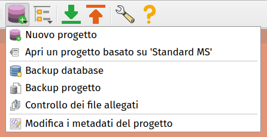
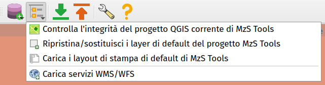

Strumenti del plugin
--------------------

Toolbar
"""""""

All'attivazione del plugin MzS Tools viene visualizzata nell'interfaccia di QGIS una **toolbar** contenente una serie di strumenti:

.. image:: ../img/plugin_toolbar.png
  :align: center

.. Note:: Se la toolbar non è presente nell'interfaccia di QGIS, è possibile riattivarla tramite il menu **Visualizza → Barre degli strumenti**.

Gli strumenti richiamabili tramite la toolbar sono:

.. |ico1| image:: ../../../mzs_tools/resources/icons/ico_nuovo_progetto.png
  :height: 25

.. |ico2| image:: ../../../mzs_tools/resources/icons/ico_importa.png
  :height: 25

.. |ico3| image:: ../../../mzs_tools/resources/icons/ico_esporta.png
  :height: 25

.. |ico4| image:: ../../../mzs_tools/resources/icons/ico_edita.png
  :height: 25

.. |ico6| image:: ../../../mzs_tools/resources/icons/ico_xypoint.png
  :height: 25

.. |ico7| image:: ../../../mzs_tools/resources/icons/mActionOptions.png
  :height: 25

|ico1| **Strumenti per la gestione del progetto**: Questo menu contiene gli strumenti per la creazione di un nuovo
progetto, per l'apertura di un progetto esistente, strumenti di gestione dei backup e degli allegati e per la modifica
dei metadati del progetto.

|ico9| **Strumenti di gestione dei layer**: Questo menu contiene alcuni strumenti per la gestione dei layer e dei layout di stampa del progetto QGIS.

|ico2| **Importa dati da un progetto esistente** → :ref:`importazione`

|ico3| **Esporta dati in una struttura di progetto standard** → :ref:`esportazione`

|ico7| **Strumenti di utilità** → :ref:`plugin-settings`

Strumenti di gestione del progetto
""""""""""""""""""""""""""""""""""

|

- **Nuovo progetto**: avvia la procedura guidata per la creazione di un nuovo progetto MzS Tools. Vedi: :ref:`nuovo-progetto`
- **Apri un progetto basato su 'Standard MS'**: questo strumento permette di importare uno studio di MS esistente, la
  cui struttura sia conforme agli Standard MS. Lo strumento crea un nuovo progetto MzS Tools per il comune indicato e
  successivamente avvia in modo automatico l'importazione dei dati.
- **Backup database**: effettua il backup del solo database del progetto corrente.
- **Backup progetto**: effettua il backup completo del progetto corrente.
- **Controllo dei file allegati**: avvia lo strumento di controllo dei file allegati. Vedi: :ref:`controllo-allegati`
- **Modifica i metadati del progetto**: apre la finestra di modifica dei metadati del progetto. Vedi: :ref:`metadata-edit`

Strumenti di gestione dei layer
"""""""""""""""""""""""""""""""

|

Strumenti di importazione ed esportazione dati
""""""""""""""""""""""""""""""""""""""""""""""

Per maggiori informazioni sui processi di importazione ed esportazione dati, fare riferimento a:

- :ref:`importazione`
- :ref:`esportazione`

Strumenti di utilità
""""""""""""""""""""

- |ico7| **Impostazioni di MzS Tools**: apre la finestra delle impostazioni del plugin. Vedi: :ref:`plugin-settings`
- **Controllo delle dipendenze del plugin**: verifica che le librerie esterne e la Java Runtime Environment richiesti
  dal plugin siano correttamente installate e funzionanti. Vedi: :ref:`plugin-deps`
- |ico8| **Aiuto di MzS Tools**: apre una finestra contenente una serie di informazioni utili sul plugin, compreso
  l'accesso a questa documentazione.

Interfacce di inserimento dati
""""""""""""""""""""""""""""""

Per ogni layer di un progetto generato dal plugin, all’interno del quale è previsto l’inserimento dati, sono impostate
una serie di funzionalità di QGIS che permettono al software di utilizzare **interfacce grafiche semplificate e
guidate** per l’inserimento delle informazioni alfanumeriche relative alle geometrie selezionate in fase di editing.

Per maggiori informazioni vai a: :ref:`editing`

Layout di stampa
""""""""""""""""

Il plugin mette a disposizione una serie di layout di stampa predisposti per i principali output cartografici degli
studi di MS. I layout sono accessibili tramite il menu “Progetto – Layout” di QGIS, all'interno di un progetto
generato dal plugin.

Per maggiori informazioni vai a: :ref:`layout-stampa`

.. _consultazione-allegati:

Strumento di consultazione rapida indagini
""""""""""""""""""""""""""""""""""""""""""

Secondo gli Standard MS le informazioni relative alle indagini devono essere
organizzate in una struttura dati composta da:

- "siti" di indagine contenenti le geometrie georeferenziate lineari e puntuali;
- "indagini" vere e proprie, in rapporto n-1 con i siti;
- "parametri", ovvero i valori registrati per ogni tipologia di indagine, in
  rapporto n-1 con le indagini.

Questo rende difficoltoso l’accesso alle informazioni delle indagini a partire
dall’interrogazione dei siti collocati su mappa, in quanto ad ogni sito possono
essere correlate n indagini, ciascuna contenente un riferimento ad un file pdf
contenente le informazioni di dettaglio.

Per semplificare l’accesso a queste informazioni è stato realizzato un apposito
strumento basato sul meccanismo delle "azioni" associate ad un layer. Questa
funzionalità di QGIS permette di associare ad un layer vettoriale delle “azioni”
basate sugli attributi associati ai singoli elementi del vettore.

In questo caso è stata sviluppata un'azione che permette di accedere a tutti i
file pdf archiviati nel progetto ed associati ad ogni indagine, semplicemente
cliccando su un "sito" d'indagine e selezionando il file pdf da aprire tramite
una apposita interfaccia grafica.

.. Note:: Per il funzionamento dello strumento è necessario che i file allegati abbiano l'ID dell'indagine incluso nel nome del file.
   E\' possibile utilizzare lo strumento **Controllo dei file allegati** per associare automaticamente gli ID delle indagini ai nomi dei file.

.. image:: ../img/pdf_search.png
  :align: center

Per l'utilizzo dello strumento è possibile procedere in questo modo:

1. Selezionare il layer "Siti puntuali" o "Siti Lineari";
2. Selezionare l’icona "Azione" e fare clic su "Cerca documenti PDF delle
   indagini associate ai siti";
3. una volta attivato lo strumento è possibile cliccare su un sito d'indagine
   visualizzato sulla mappa per effettuare la ricerca dei documenti associati;
4. i risultati della ricerca vengono presentati in una apposita finestra
   contenente la lista dei file trovati.
