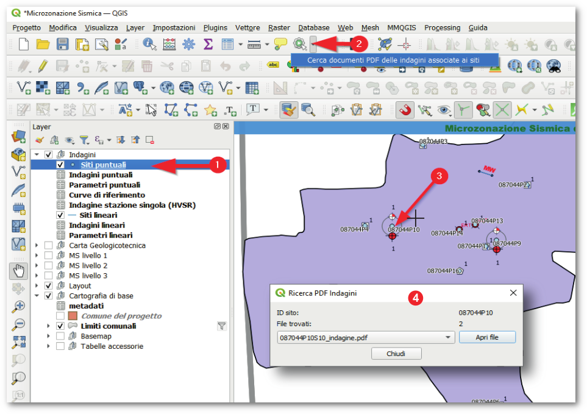

Strumenti del plugin
--------------------

Toolbar
"""""""

All'attivazione del plugin MzS Tools viene visualizzata nell'interfaccia di QGIS una **toolbar** contenente una serie di strumenti:

|

.. Note:: Se la toolbar non è presente nell'interfaccia di QGIS, è possibile riattivarla tramite il menu **Visualizza → Barre degli strumenti**.

Gli strumenti richiamabili tramite la toolbar sono:

.. |ico1| image:: ../../../img/ico_nuovo_progetto.png
  :height: 25

.. |ico2| image:: ../../../img/ico_importa.png
  :height: 25

.. |ico3| image:: ../../../img/ico_esporta.png
  :height: 25

.. |ico4| image:: ../../../img/ico_edita.png
  :height: 25

.. |ico5| image:: ../../../img/ico_salva_edita.png
  :height: 25

.. |ico7| image:: ../../../img/ico_copia_ms.png
  :height: 25

.. |ico8| image:: ../../../img/ico_info.png
  :height: 25

.. |ico9| image:: ../../../img/mActionAddHtml.png
  :height: 25

|ico1| **Nuovo progetto** → :ref:`nuovo-progetto`

|ico9| **Modifica metadati di progetto** → :ref:`metadata-edit`

|ico2| **Importa dati da un progetto esistente** → :ref:`importazione`

|ico3| **Esporta dati in una struttura di progetto standard** → :ref:`esportazione`

|ico6| **Aggiungi un Sito Puntuale utilizzando le coordinate XY** → :ref:`sito-xy`

|ico7| **Copia gli oggetti dai layer Stab o Instab** → :ref:`copia-oggetti`

|ico8| **Aiuto**

Interfacce di inserimento dati
""""""""""""""""""""""""""""""

Per ogni layer di un progetto generato dal plugin, all’interno del quale è previsto l’inserimento dati, sono impostate una serie di funzionalità di QGIS che permettono al software di utilizzare **interfacce grafiche semplificate e guidate** per l’inserimento delle informazioni alfanumeriche relative alle geometrie selezionate in fase di editing.

Per maggiori informazioni vai a: :ref:`editing`

Layout di stampa
""""""""""""""""

Il plugin mette a disposizione una serie di layout di stampa predisposti per i principali output cartografici degli studi di MS. I layout sono accessibili tramite il menu “Progetto – Layout” di QGIS, all'interno di un progetto generato dal plugin. 

Per maggiori informazioni vai a: :ref:`layout-stampa`

Strumento di consultazione rapida indagini
""""""""""""""""""""""""""""""""""""""""""

Secondo gli Standard MS le informazioni relative alle indagini devono essere
organizzate in una struttura dati composta da:
    
- "siti" di indagine contenenti le geometrie georeferenziate lineari e puntuali;
- "indagini" vere e proprie, in rapporto n-1 con i siti;
- "parametri", ovvero i valori registrati per ogni tipologia di indagine, in
  rapporto n-1 con le indagini.

Questo rende difficoltoso l’accesso alle informazioni delle indagini a partire
dall’interrogazione dei siti collocati su mappa, in quanto ad ogni sito possono
essere correlate n indagini, ciascuna contenente un riferimento ad un file pdf
contenente le informazioni di dettaglio.

Per semplificare l’accesso a queste informazioni è stato realizzato un apposito
strumento basato sul meccanismo delle "azioni" associate ad un layer. Questa
funzionalità di QGIS permette di associare ad un layer vettoriale delle “azioni”
basate sugli attributi associati ai singoli elementi del vettore.

In questo caso è stata sviluppata un'azione che permette di accedere a tutti i
file pdf archiviati nel progetto ed associati ad ogni indagine, semplicemente
cliccando su un "sito" d'indagine e selezionando il file pdf da aprire tramite
una apposita interfaccia grafica.

Per l'utilizzo dello strumento è possibile procedere in questo modo:

1. Selezionare il layer "Siti puntuali" o "Siti Lineari";
2. Selezionare l’icona "Azione" e fare clic su "Cerca documenti PDF delle
   indagini associate ai siti"; 
3. una volta attivato lo strumento è possibile cliccare su un sito d'indagine
   visualizzato sulla mappa per effettuare la ricerca dei documenti associati;
4. i risultati della ricerca vengono presentati in una apposita finestra
   contenente la lista dei file trovati.